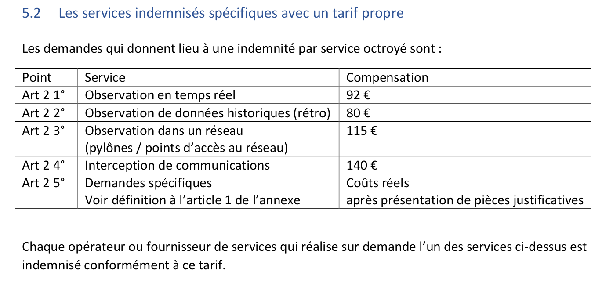

## Cellule de Coordination avec la Justice

En septembre 2021, l'[IBPT](http://ibpt.be/) (Institut belge des services postaux et des télécommunications) via un email nous a averti de l'obligation de constituer une CCJ(Cellule de Coordination avec la Justice) comme expliqué dans [la Brochure Informative - Obligations Collaboration Autorités Judiciaires](https://www.ibpt.be/file/cc73d96153bbd5448a56f19d925d05b1379c7f21/4cda9d352da1912b728c4517c70ce9c2de5815c2/Brochure_Informative_Obligations_Collaboration_Autorites_Judiciaires.pdf).

Nous voici devant un nouveau vollet, juridique et technique, de la vie d'un opérateur télécom en Belgique, et parmis les 413 entités morales enregistrées à l'IBPT, il n'y a qu'une VZW ([thelastmile.be](http://www.thelastmile.be)) et … une ASBL, Neutrinet.

## Contexte

Actuellement *(novembre 2021)*, Neutrinet asbl met à disposition de chacun·e, une seule solution technique; le [VPN](/vpn).

Cela nous permet de mettre en avant le projet de [Labriqueinter.net](/cube) qui se repose sur du matérielle ouvert *(Olimex Lime 1 & 2)* et des logiciels libres *(YunoHost)* pour encourager l'[auto-hébergement](https://fr.wikipedia.org/wiki/Auto-h%C3%A9bergement_(Internet)), la [décentralisation](https://fr.wikipedia.org/wiki/Red%C3%A9centralisation_d%27Internet), la [neutralité](https://fr.wikipedia.org/wiki/Neutralit%C3%A9_du_r%C3%A9seau) en participant à la construction du réseau Internet. Nous sensibilisons nos membres sur la neutralité des réseaux et sommes membres de la Fédération FDN qui se repose sur une charte nous obligeant de garantir cette neutralité des réseaux en tant que [système autonome](https://fr.wikipedia.org/wiki/Autonomous_System) répondant au doux nom de [AS204059](https://ipinfo.io/AS204059).

Depuis 2018, plusieur·e·s d'entre nous œuvrent pour mettre en place d'autres solutions techniques telles que la location de machines virtuelles (VPS), peut-être le partage d'une armoire dans un centre de données et bien entendu, poursuivre le projet [Backhaul (collecte](https://mediawiki.neutrinet.be/Project:Backhaul_(collecte).html) commencé en 2010 pour arriver à proposer de l'accès internet via le câble (vdsl, coax, ...) et nous y sommes presque.

Depuis 2019, nous payons un abonnement Proximus pour une occupation de *sans-droits*, mais récemment d'autres associations sont venues nous voir concernant d'autres occupations pour donner un coup de main technique avec un autre opérateur, Edpnet.

### Obligations légales

[ui-tabs position="top-left" active="0" theme="default"]

[ui-tab title="Membres de la cellule"]

Il faut au minimum une personne au sein de la CCJ.  Plusieurs serait judicieux par soucis de disponibilité et de contrôle interne au sein de Neutrinet asbl.  Chaque membre de la CCJ subira une [enquête d'avis de sécurité](#TODO-détail-explication) (casier vierge, pas de collusion avec un parti politique, pas d'influence d'une entité étrangère, ...) pour pouvoir répondre aux demandes reçues par les autorités belges.

Les personnes renseignées dans cette cellule **devront s'assurer de la légalité de la demande**. Celle-ci doit correspondre à un article de loi, si cela n'est pas le cas les membres de la cellule **peuvent refuser de fournir les informations demandées**. Les membres de la CCJ, **tenu·e·s au secret, ne peuvent communiquer en dehors de la cellule** sur les enquêtes en cours, seule exception : faire appel à un·e technicien·e (cf. onglet Technicien·e·s).

**En cas d'enquête**, nous devons aussi être en mesure de **lever l'identité de l'utilisateur·ice** utilisant le service concerné. Cela peut se faire par copie de carte d'identité (physique ou électronique), validation par SMS ou par voie postale. Nous proposons de retenir la solution SMS et voie postale, car elle nous semble la moins intrusive. La voie postale peut servir pour des personnes sans papier en indiquant un lieu de référence (CPAS, association qui peut assurer ce rôle (attention, toutes les asbl ne sont pas habilitées à le faire : Neutrinet ne pourrait donc pas assurer ce rôle).

[/ui-tab]
[ui-tab title="Technicien·e·s"]

Si les membres de la CCJ n'ont pas la capacité technique, iels **peuvent demander à un technicien de leur fournir les informations demandées**. Ce technicien doit s'assurer de la légitimité de la demande (mandat du procureur, etc.). L'IBPT définit comme technicien toute personne qui vient en aide à la CCJ pour donner suite à la demande.

[/ui-tab]
[/ui-tabs]

### Obligations techniques

[ui-tabs position="top-left" active="0" theme="default"]
[ui-tab title="VPN"]

**Dans le cadre du VPN** nous devons **conserver l'adresse IP d'origine qui établit le tunnel** et **l'adresse IP fournie par Neutrinet**, et ce, pendant un an maximum (cela pourrait passer à 6 mois).

Nous devons instaurer une méthode pour valider l'identité de nos membres utilisant le VPN soit par SMS, voie postale ou copie de carte d'identité (électronique ou physique).

Il est possible que, dans le cadre d'une enquête, les autorités compétentes nous demandent **d'enregistrer le flux réseaux d'une IP Neutrinet** avec ce que l'on appelle dans le jargon des [PCAP](#TODO-lien-wikipédia?) (packet capture). 

! Ce point-ci n'est pas clair si c'est une obligation pour les VPN, et d'après les différents témoignages que nous avons reçus les personnes n'ont pas dû faire ce genre de capture (mais elle est prévue par la loi).

! Le VPN est un service applicatif et Neutrinet ne doit pas être membre de l'IBPT..

[/ui-tab]
[ui-tab title="Collecte"]

**Dans le cadre de la collecte** (fournir des connexions internet sur le territoire belge) nous devrons avoir la possibilité d’installer l'enregistrement du flux réseau sur une ligne précise. Et même remarque que pour le VPN sur base des témoignages que nous avons reçus.

! La collecte est un service d'oppérateur des télécommunication et Neutrinet doit être membre de l'IBPT

[/ui-tab]
[ui-tab title="Wifi publique"]

Neutrinet ABSL ne fait pas de WIfi Publique *(pas actuellement en tout cas)*. Mais nous pourrions être amené·e·s à le faire dans le cadre des occupations de lieux par des personnes marginalisées telles que les sans-papiers *(et autre sans-droits)*.

! TODO - approfondir

[/ui-tab]
[ui-tab title="Hébergement"]

Neutrinet ASBL, en dehors de ses propres services (site web, wiki, nextcloud, etc) ne fait pas encore d'hébergement, mais dans le cadre du projet « Chez Mémé *(hébergement de machines vertuelles)* » ou « 42u *(partage d'un rack dans le data-center)* » cela pourrait devenir le cas.

! TODO - approfondir

[/ui-tab]
[/ui-tabs]

### Renseignements

! TODO mettre en onglet aussi ?

- levée d'identité
- informations de connexion
- enregistrement de flux (exemple pour la VOIP (Sébastien))

! TODO - comparer / faire correspondre avec la grille des tarifs qui, si je ne me trompe, résume le genre de renseignements et de tarif que nous pouvons demander

## Les possibilités pour Neutrinet
Maintenant que le contexte est posé, quelles sont les différentes possibilités pour Neutrinet?

[ui-tabs position="top-left" active="0" theme="default"]
[ui-tab title="Sortir de L'IBPT ?"]
Nous avons comme possibilité de ne plus être renseigné auprès de l'IBPT, et donc de ne plus être soumis aux obligations de créer une CCJ.

**Conséquence**

- Nous ne devons pas créer de CCJ.
- Nous ne participons pas à la surveillance capitaliste, car nous sommes acteur du secteur non marchand et l'État ne se décharge pas sur nous d'une de ses missions.
- Nous devons quand même nous assurer de la conservation des logs (obligation légale)
- Nous perdons le statut de « vrai » FAI.
- Nous ne sommes plus au courant des obligations auxquelles doivent répondre les autres FAI.

**Avenir pour Neutrinet**

Nous renforçons notre but social sur la formation (éducation permanante), sensibilisation du fonctionnement des réseaux et axons Neutrinet sur la décentralisation (VPN) et l'hébergement de machines virtuelles (VPS).

Le jour où nous souhaiterons faire de la collecte, nous devrons nous renseigner sur l'obligation de rejoindre l'IBPT à nouveau. 

Cette option nous permet de nous laisser du temps pour réfléchir comment légalement nous souhaitons nous structurer (refonte des statuts de l'ASBL, entité séparée pour la collecte, etc.), et cela nous permet de sortir de « l'urgence » de créer une CCJ.
[/ui-tab]
[ui-tab title="Constituer une CCJ ?"]
Nous avons comme possibilité de constituer une CCJ et nous conformer a la loi.

**Conséquence**

- Nous devons mettre le moyen technique pour identifier les utilisateurs du VPN.
- Nous devons nous assurer de la conservation des logs sur 1 an.
- Nous devons avoir au moins un membre dans cette cellule.
- Nous nous conformons à la surveillance d'État et facilitons le travail d'enquête.
- Nous restons un « vrai » FAI 
- Nous restons informé des obligations que doivent répondre les FAI belges.

Par ailleurs, si nous répondons favorablement à une demande par un moyen technique donné, nous devons nous attendre à ce qu'on nous redemande des informations via ce même moyen technique. Autrement dit, toute solution technique mise en place doit être considérée comme acquise (ex: les PCAP). Ce qui peut nous pousser à mettre de plus en plus de solutions de surveillances afin de répondre aux demandes d'enquête.

**Avenir pour Neutrinet**

Nous pouvons continuer notre objectif de fournir des connexions physiques sachant que cela demande beaucoup de travail, nous aurons moins de temps pour sensibiliser/former nos membres.

[/ui-tab]
[ui-tab title="Fin de Neutrinet ?"]

Bien que cette possibilité existe, nous ne l'envisageons pas, car nous désirons toujours trouver une solution pour continuer d'exister et de poursuivre le but social de l'ASBL.

[/ui-tab]
[/ui-tabs]

## Ressources

[ui-tabs position="top-left" active="0" theme="default"]
[ui-tab title="Pads"]

- [CCJ et AR collaboration](https://pad.caldarium.be/_4zMiyzpQ2eG1Ft9cA--Qg#)

[/ui-tab]
[ui-tab title="Wiki"]

- [réunion des hubs du 2021/09/21, point ccj](https://wiki.neutrinet.be/fr/rapports/2021/09-21#ccj)
- [réunion du hub-admin du 2021/09/29 sur ccj](https://wiki.neutrinet.be/fr/rapports/2021/09-29)
- [réunion du hub-admin du 2021/10/07 sur ccj](https://wiki.neutrinet.be/fr/rapports/2021/10-07)
- [réunion des hubs du 2021/10/19, point ccj](https://wiki.neutrinet.be/fr/rapports/2021/10-19#ccj)

[/ui-tab]
[ui-tab title="Gits"]

- [Appel téléphonique à l'IBPT du 2021-10-11](https://gist.github.com/wget/fdca2fa763dbb82bdb9a8a00e0b4fda6)
- [Appel téléphonique à l'IBPT du 2021-10-12](https://gist.github.com/wget/3859e6f166a9d6de26a8bbe469d31c81)

[/ui-tab]
[ui-tab title="Blog"]

- [CCJ ou c'est la fin de Neutrinet ?](https://neutrinet.be/fr/blog/ccj)

[/ui-tab]
[ui-tab title="Mattermost"]

- [retour suite à une rencontre avec un juriste](https://chat.neutrinet.be/neutrinet/pl/tft8g4q6h7gjtmm7k9quig7a3o) - accès limité aux personnes qui sont dans le hub-admin.

[/ui-tab]
[/ui-tabs]
