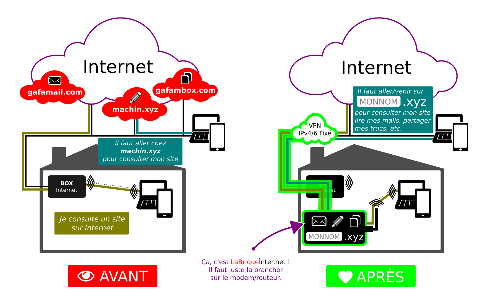

# Hot Spot Wifi _(Étape 2)_

[center][/center]

## Choisir le matériel

!! Si votre ambition est d'héberger quelques boîtes mail, des fichiers voir d'autres services Internet, alors allez directement voir à [l'étape 4](/brique/nextcloud_detail) la configuration recommandée.

Si vous avez l'intention de **juste partager un VPN** au travers d'une connexion Wifi pour la maison, alors ceci devrait suffire pour un budget de **±75,00€**:

* une carte mère [Lime1](https://www.olimex.com/Products/OLinuXino/A20/A20-OLinuXino-LIME/open-source-hardware)
* une [alimentation](https://www.olimex.com/Products/Power/SY0605E/)
* un [boitier](https://www.olimex.com/Products/OLinuXino/BOXES/BOX-LIME/)
* une antenne Wifi [libre](https://www.olimex.com/Products/USB-Modules/MOD-WIFI-AR9271-ANT/) ou [propriétaire](https://www.olimex.com/Products/USB-Modules/MOD-WIFI-R5370-ANT/)
* une carte [MicroSD Class 10](http://www.misco.be/FR/carte-memoire-sd-et-micro-sd/c1026.htm?v=14320090-14320113-14320114-14320115)

Mais si vous souhaitez comprendre pourquoi et vous faire votre propre idée, alors c'est que vous cherchez sans doute plus d'[autonomie](/brique/autonomie_detail).

! Si vous ne souhaitez pas commander vous-même sur le site Olimex, n'hésitez pas à [passer commande chez nous](https://admin.neutrinet.be/)

## Coût récurents

Le VPN à prix libre, ± 8€ par mois.

Un nom de domaine bien que pour « simplement » partager le VPN sur un réseau Wifi, un nom de domaine noho.st ou nohost.me suffit largement.

* Payer pour un nom de domaine (abc.xyz) ou utiliser un domaine offert (abc.noho.st ou abc.nohost.me)

## Installer vous-même

* Installer Yunohost avec
  * l'application client VPN
  * l'application Hot Spot
  * l'application Neutrinet

## Installons ensemble

* lors d'une [Install party](/#install_party)

## Payer quelqu'un pour installer

* lien vers un service payant ?
* pour l'installation et la configuration ?
* pour le suivi, les maj, les sauvegardes ?