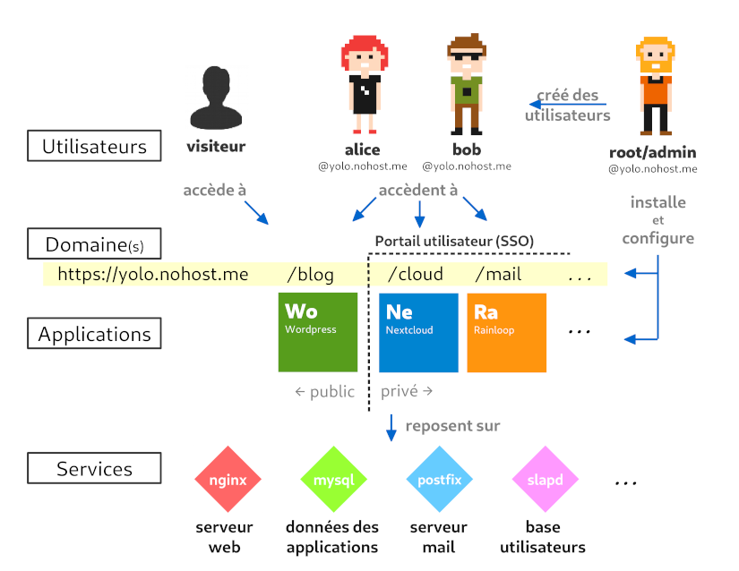

## Vers une plus grande autonomie

Mais de quoi est constituée [[color=red]LaBrique[/color][color=black]Înter.net[/color]](https://labriqueinter.net) ?

## Le matériel

### De l'électricité

[ui-tabs position="top-left" active="0" theme="default"]
[ui-tab title="Nécessaire"]

Une alimentation électrique est indispensable.

!!!! Faible consommation !

**Sur le site de Olimex**: [SY0605E](https://www.olimex.com/Products/Power/SY0605E/) pour l'Europe.

[/ui-tab]
[ui-tab title="Options & Bidouilles"]

Des batteries de capacité différente sont disponibles.

* Pour palier aux coupures de courant brutales ou intenpestives.
* Si vous voulez faire une [PirateBox](https://github.com/labriqueinternet/piratebox_ynh) portable. _(Mais c'est hors VPN et « sans Internet »)_
* Utilisez une [prise programmable](https://www.qwant.com/?q=Prise%20programmable&t=images) pour alterner entre la prise de courant et la batterie.

**Sur le site de Olimex**: par exemple [Battery-LIPO6600mAh](https://www.olimex.com/Products/Power/BATTERY-LIPO6600mAh/)
[/ui-tab]
[/ui-tabs]

### Une carte mère avec processeur, mémoire vive, etc.

[ui-tabs position="top-left" active="0" theme="default"]
[ui-tab title="Lime1"]

* Allwinner A20 dual-core ARM [Cortex-A7](https://fr.wikipedia.org/wiki/ARM_Cortex-A7_MPCore) @ 1GHz
* 512Mb de mémoire vive _(ne sous-estimmez pas ce qu'on peut faire avec ça!)_
* 1 port Etherntet 100Mbit
* 1 port SATA _(à utiliser avec le [SATA-CALBESET](https://www.olimex.com/Products/Components/Cables/SATA-CABLE-SET/))_
* 2 ports USB 2.0 _(puissance électrique limitée)_
* 1 port MicroSD supportant les cartes jusqu'a 32Gb.

**Sur le site de Olimex**: [A20-OLinuXino-LIME](https://www.olimex.com/Products/OLinuXino/A20/A20-OLinuXino-LIME/open-source-hardware)

[/ui-tab]
[ui-tab title="Lime2"]

* Allwinner A20 dual-core ARM [Cortex-A7](https://fr.wikipedia.org/wiki/ARM_Cortex-A7_MPCore) @ 1GHz
* **1024Mb** de mémoire vive
* 1 port Etherntet **1Gbit**
* 1 port SATA _(à utiliser avec le [SATA-CALBESET](https://www.olimex.com/Products/Components/Cables/SATA-CABLE-SET/))_
* 2 ports USB 2.0 _(puissance électrique limitée)_
* 1 port MicroSD supportant les cartes jusqu'a **64Gb**.

**Sur le site de Olimex**: [A20-OLinuXino-LIME2](https://www.olimex.com/Products/OLinuXino/A20/A20-OLinuXino-LIME2/open-source-hardware)

[/ui-tab]
[ui-tab title="Autre Matériel ?"]

Nous proposons du matériel [Olimex](https://www.olimex.com/) parce que c'est **un projet plus libre et ouvert** que Raspberry. Ce dernier embarque du matériel propriétaire Broadcom [¹](https://linuxfr.org/news/olinuxino-la-raspberry-pi-version-open-source).

!!! Utilisez un ancien PC portable, un RaspberryPI, un serveur physique ou virtuel…

Si vous avez besoin de plus de preformance, [Yunohost est compatible](https://yunohost.org/#/hardware_fr) avec ce que vous voulez.

[/ui-tab]
[/ui-tabs]

### Stockage

[ui-tabs position="top-left" active="0" theme="default"]
[ui-tab title="Carte MicroSD"]

Il n'y a pas que la taille que compte _(jusqu'à 64Gb pour la Lime2)_! Il y a aussi la vitesse et la robustesse.

!! * La carte MicroSD est **indispensable** pour le démarrage des Olimex Lime1 et Lime2.  
!! * Nous recommandons les cartes de [classe 10](https://fr.wikipedia.org/wiki/Carte_SD#Vitesse) et [HC-I](https://fr.wikipedia.org/wiki/Carte_SD#UHS).  
!! * Si vous envisagez une utilisation intensive _(Serveur mail, Nextcloud, Plusieurs utilisateur·ice·s… )_ utilisez la carte MicroSD pour le démarrage et [migrez vers un disque SATA](https://www.weblib.re/dokuwiki/doku.php?id=brique_sata) le système et les données.

Vous pouvez vous contentez d'utiliser [[color=red]labrique[/color][color=black]Înter.net[/color]](https://labriqueinter.net/) sur une carte MicroSD mais pensez à vos **sauvegardes**.

[/ui-tab]
[ui-tab title="Disque Dur SATA"]  

Il n'est pas encore possible d'installer une brique **directement** sur un disque connecté à la Lime1 ou la Lime2 avec une [SATA-CALBE-SET](https://www.olimex.com/Products/Components/Cables/SATA-CABLE-SET/). **Mais** il est tout à fait possible de [déplacer une installation existante _(en anglais)_](https://wiki.labriqueinter.net/doku.php?id=howto:install_sata) depuis la carte MicroSD vers un disque dur!

Donnez à [[color=red]labrique[/color][color=black]Înter.net[/color]](https://labriqueinter.net/) **plus d'espace de stockage** _(1Tb, 2Tb, voir plus!)_ et surtout **plus de robustesse** comparé avec une carte MicroSD.

!!!! N'oubliez pas qu'une carte **MicroSD est nécessaire** au démarrage des Lime1 et Lime2.

Un [HDD](https://fr.wikipedia.org/wiki/Disque_dur) suffit parce que les cartes Lime1 et Lime2 sont _« moins rapides que le disque dur »_ Pas besoin d'investir dans un [SSD](https://fr.wikipedia.org/wiki/Solid-state_drive). Mais si vous avez les moyens, pourquoi pas, ça consomme moins d'électricité _(à vérifier)_.

[/ui-tab]
[ui-tab title="Disque Dur USB"]  

En partant de l'idée qu'un des deux ports USB soit utilisé par une carte réseau Wifi, il reste un de libre!  Alors améliorez encore [[color=red]labrique[/color][color=black]Înter.net[/color]](https://labriqueinter.net/) en lui mettant un disque USB pour y vos **sauvegardes** ou vos bibliothèques multi-médias.

!! Attention, avec une carte wifi qui consomme déjà l'éléctricité du port USB, seul un disque externe **avec une alimentation électrique** fonctionnera.

[/ui-tab]
[/ui-tabs]

### Antenne Wifi et…

[ui-tabs position="top-left" active="0" theme="default"]
[ui-tab title="Wifi Libre"]

!!!! L'antenne Wifi dont le [pilote](https://fr.wikipedia.org/wiki/Pilote_informatique) est open source **et** libre

MOD-WIFI-AR9271(-ANT) is USB WiFi adapter which is with Open Source Linux driver and Linux Kernel build in support since Kernel 2.6.35

**Sur le site de Olimex**: [MOD-WIFI-AR9271](https://www.olimex.com/Products/USB-Modules/MOD-WIFI-AR9271-ANT/)

[/ui-tab]
[ui-tab title="Wifi propriétaire"]  

! Bien que cette antenne contribue au charme de [[color=red]labrique[/color][color=black]Înter.net[/color]](https://labriqueinter.net/), elle fonctionne avec un [pilote](https://fr.wikipedia.org/wiki/Pilote_informatique) qui n'est **pas entièrement libre**. Voyez la section sur les **micrologiciels non libres** de [cette page de la FSF](https://www.gnu.org/distros/free-system-distribution-guidelines.fr.html).

**Sur le site de Olimex**: [MOD-WIFI-R5370-1](https://www.olimex.com/Products/USB-Modules/MOD-WIFI-R5370-ANT/)

[/ui-tab]
[ui-tab title="Options & Bidouilles"]  

Utilisez le stick USB vers Ethernet avec [ce tuto](https://hackstub.netlib.re/wiki/index.php?title=Utiliser_une_brique_pour_faire_un_NAT) pour comlpétez ou remplacer le wifi et distribuer un accès Internet _(nettoyé par notre [vpn](/vpn))_ sur le réseau câblé de la maison.  Rien que ça ! `^_^`

! Pour les bidouilleurs et les bidouilleuses qui n'aiment pas les ondes.

**Sur le site de Olimex**: [USB-ETHERNET-AX88772B](https://www.olimex.com/Products/USB-Modules/USB-ETHERNET-AX88772B/)
[/ui-tab]
[/ui-tabs]

### Boitier

[ui-tabs position="top-left" active="0" theme="default"]
[ui-tab title="Métallique"]

Il n'y a plus que la version métallique du boiter pour les Lime1 et Lime2.

Bien que ce boitier existe en différents coloris, nous ne prenons que le noir. Libre à vous de le commander dans une autre couleur.

! [Attention aux boutons!](/blog/boitier-metallique)

**Sur le site de Olimex**: [BOX-LIME-BLACK-1](https://www.olimex.com/Products/OLinuXino/BOXES/BOX-LIME/)

[/ui-tab]
[ui-tab title="<s>Plastique</s>"]

Ce boitier aura fait partie de [[color=red]LaBrique[/color][color=black]Înter.net[/color]](https://labriqueinter.net) depuis ses début.  Il n'était compatble qu'avec la Lime1 mais maintenant qu'elle a été redessinée, elle ne rentre plus dedans. Dommage, on l'aimait bien.

**Sur le site de Olimex**: Est renseigné comme étant obsolète.

[/ui-tab]
[/ui-tabs]

## Les logiciels

Bien que le matériel présenté ci-dessus soit en mesure d'accueillir [différentes distributions GNU/Linux pour processeur ARM](https://www.linux-arm.info/index.php/other-distributions), c'est [Yunohost](https://yunohost.org/#/install_on_arm_board_fr) que nous recommandons pour vous lancer dans l'[auto-hébegement](https://yunohost.org/#/selfhosting_fr).

## Ils en parlent Aussi

**Chez des membres de la FFDN**

* [Résine](https://www.rezine.org/acc%C3%A8s_Internet_local/labrique/)
* [Franciliens](https://www.franciliens.net/brique-internet/)
* [Iloth](https://iloth.net/brique-internet/)
* [Loraine Data Network](https://ldn-fai.net/la-brique-internet/)
* [Mycélium](https://mycelium-fai.org/wiki/documentation/briques_internet)

**Sur le wiki du projet**

* [Wiki de la brique](https://wiki.labriqueinter.net/doku.php)

**Et le forum Yunohost**

* [Le support de labrique](https://forum.yunohost.org/c/support/internet-cube)