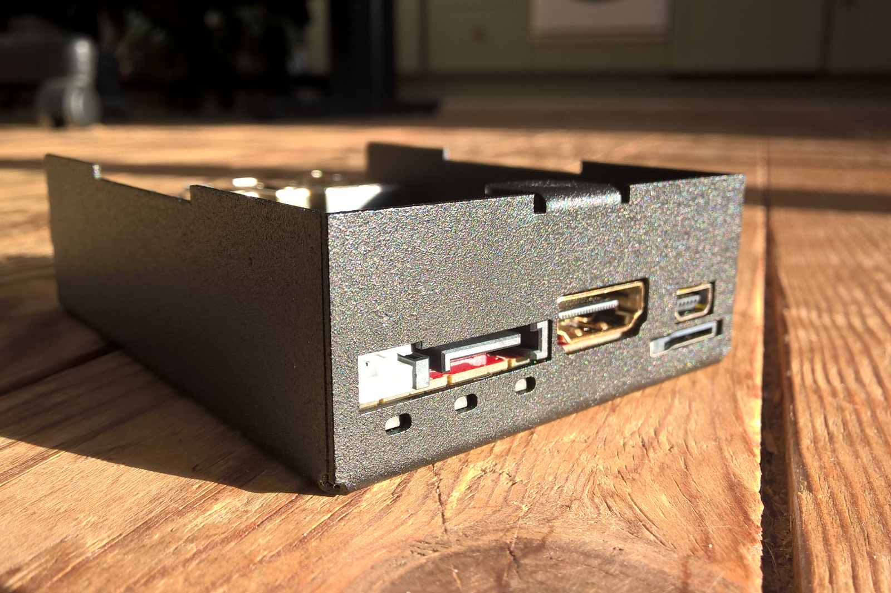
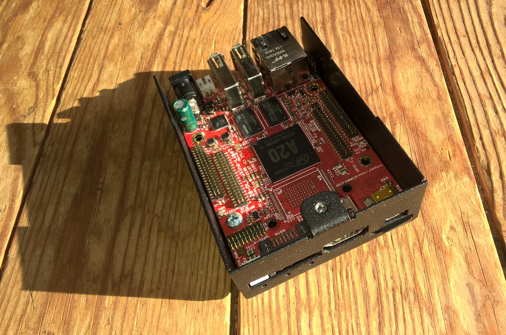

Si votre brique dispose d'un boitier en métal et qu'elle ne démarre pas, c'est peut-être dû à un truc tout con.

===

## Problème

La brique ne s'allume pas quand vous utilisez un boitire métalique Olimex ?

## Cause

Parce que les **trois trous** pour les boutons des carte Lime1 et Lime2 sont **trop petits**.

Lorsqu'on referme le boitier, il y a un **effet de pression** sur les boutons.qui s'enfoncent à cause des trous trop petits.  Ce qui a comme effet d'envoyer les signal d'extinction, de reset, ou de redémarrage et qui empêche la carte de démarrer correctement.

## Bidouille

Pour fixer les cartes Lime1 & Lime2 au boitier métalique, choisissez l'emplacement qui est un peu derrière les 3 boutons.

Lorsque vous serrerez la visse, il faut pousser la LIME2 le plus loin du bord possible, ça pourrait aider. Ça se joue probablement à quelques micro-mètres, mais ça suffit.

!! Souvenez vous en à chaque fois que vous enfoncerez l'alimentation électrique qui se trouve à l'opposé.

## Solution

L'idéal serait d'agrandir les trois trous prévus pour les boutons.