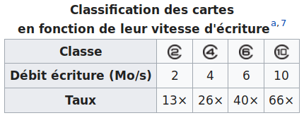
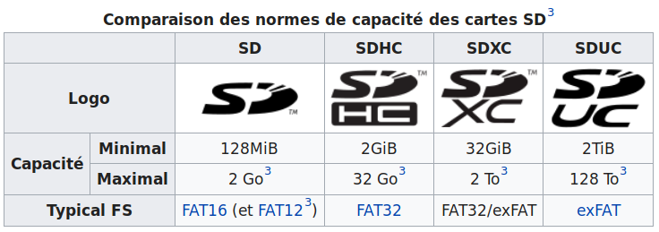

Puisque la carte MicroSD est l'unité centrale qui contiendra toutes les données, le système d'exploitation et les différents logiciels d'une Brique Internet, il est important de bien choisir son matériel.

===
## La vitesse

Les bus de données des cartes Olimex LIME1 et LIME2 font plus ou moins 20MB/s en lecture et écriture et que la majorité des cartes MicroSD font du 10MB/s en écriture, c'est déjà limiter la vitesse de sa Brique Internet.  Pour trouver une carte un peu plus performante, ce sont des informations utiles qu'il vaut mieux prendre en compte lors de l'achat.

Il est fortement conseillé de prendre une carte MicroSD de « Classe 10 » minimum.



Plus d'info sur [wikipedia](https://fr.wikipedia.org/wiki/Carte_SD#Vitesse).

###  Quelques essais
```
16Gb Kingston Gold SDHC Class 10 UHS Class 3 on a LIME1
$ sudo dd if=/dev/zero of=test bs=1048576 count=512
536870912 bytes (537 MB) copied, 23.3035 s, 23.0 MB/s


16Gb Transcend Premium 400x SDHC Class 10 UHS Class 1 on a LIME1
$ sudo dd if=/dev/zero of=test bs=1048576 count=512
536870912 bytes (537 MB) copied, 58.7851 s, 9.1 MB/s
536870912 bytes (537 MB) copied, 138.966 s, 3.9 MB/s

16Gb Kingston Industrial SDHC Class 10 UHS Class 1 on a LIME1
$ sudo dd if=/dev/zero of=test bs=1048576 count=512
512+0 records in
512+0 records out
536870912 bytes (537 MB) copied, 47.1847 s, 11.4 MB/s
```

## La capacité

Attention que les cartes mère Olimex LIME1 et LIME2 sont limitées à 32GB, sauf erreur de notre part, mais c'est ce qui est dit dans leur [manuel](https://www.olimex.com/Products/OLinuXino/A20/A20-OLinuXino-LIME2/resources/A20-OLinuXino-LIME2-UM.pdf).



Ici aussi, vous trouverez plus d'info sur [wikipedia - anglais](https://en.wikipedia.org/wiki/SD_card#Capacity)