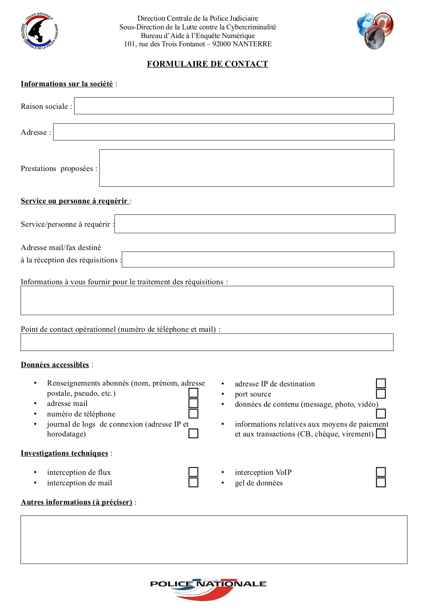

Le 5 février 2020 nous avons reçu un mail de DCPJ sdlc-baen <sdlc-baen@interieur.gouv.fr> avec un adorable sujet **Prise de contact - Modalités d'envoi des Réquisitions judiciaires - Direction Centrale de la Police Judiciaire / Sous-Direction de la Lutte contre la Cybercriminalité**.

===

## Le mail reçu

Le contenu de cette Nationale Missive étant le suivant :

> Bonjour,

> Nous nous permettons de vous contacter afin d'établir un pont de communication avec vos services.

Jusque là, bha!  On se dit que c'est mignon, cordial, un contact, un _pont de communication_, toussa toussa.

> Nous sommes le Bureau d'Aide à l'Enquête Numérique ( B.A.E.N ) de la Sous-Direction de la Lutte contre la Cybercriminalité ( S.D.L.C ) appartenant à la Direction Centrale de la Police Judiciaire ( D.C.P.J ). Nous sommes les Référents Nationaux des Services de Police en France dans le domaine de la cybercriminalité.

Le second paragraphe avec plein d'acronymes nous fait un peu activer douze neurones _(4 lettres x 3 accronymes, ça fait bien 12)_ et là comment dire ?  C'est déjà pas mal culotté, mais attendez l'analyse du formulaire qui était joint au mail et que vous trouverez un peu plus bas…

Donc déjà, la Surveillance en France c'est bien organisé :

0. [Ministère de l'Intérieur](https://fr.wikipedia.org/wiki/Minist%C3%A8re_de_l%27Int%C3%A9rieur_(France))
1. [Direction générale de la Police nationale](https://fr.wikipedia.org/wiki/Direction_g%C3%A9n%C3%A9rale_de_la_Police_nationale#Directions_et_services)
2. [Direction centrale de la Police judiciaire](https://fr.wikipedia.org/wiki/Direction_centrale_de_la_Police_judiciaire_(France)) - 1 des 3 accronymes
3. [Sous-Direction de la Lutte contre la Cybercriminalité](https://lannuaire.service-public.fr/gouvernement/administration-centrale-ou-ministere_632496) - le deuxième
4. [Bureau d'Aide à l'Enquête Numérique](https://lannuaire.service-public.fr/recherche?whoWhat=Bureau+d%27Aide+%C3%A0+l%27Enqu%C3%AAte+Num%C3%A9rique&where=) - le troisième.

Ce sympathique Bureau d'Aide à l'Enquête Numérique nous est décrit dans le mail que nous avons reçu :

> Notre travail consiste, entre autres, à contacter les entreprises susceptibles de pouvoir contribuer à la résolution d'une enquête judiciaire par le biais de la divulgation, sous contrôle de réquisition judiciaire, de données techniques concernant principalement les utilisateurs.

> En effet, notre Direction ainsi que d'autres services de Police sont en charge de tous les types de délits liés à l'utilisation d'Internet et les données que vous pouvez nous fournir sont essentielles, par exemple dans le cas de disparitions, d'atteintes graves à la vie humaine, de pornographie enfantine, d'apologie du terrorisme, d'escroqueries de tous types (ce ne sont là que des exemples) dont les utilisateurs de vos services pourraient être considérés comme victimes ou auteurs.

> Comme nous le faisons avec toutes les sociétés dont tout ou partie de l'activité est liée à l'usage d'internet, nous prenons contact afin de convenir de modalités de contact cohérentes pour l'envoi des réquisition judiciaires grâce au formulaire en pièce-jointe.

> Nous les portons ensuite à la connaissance des enquêteurs de la Police en cas de besoin, via un site intranet du Ministère de l'Intérieur. Il leur appartient d'apprécier la pertinence de vous solliciter ultérieurement.

> Pour toute question, nous sommes disponibles au numéro figurant en signature de mail.

Allez, soyons sympa, aidons les dans leur travail qui doit être si difficile par les temps qui courent *(vous savez, terrorisme, pédophilie, toussa toussa)*.  Mais est-ce que le coup de main demandé *(voir le formulaire décrit plus bas)* n'est pas un peu exagéré alors qu'il y a bien d'autres [principales causes de décès et de morbidité](https://drees.solidarites-sante.gouv.fr/IMG/pdf/esp2017_5_principales_causes_de_deces_et_de_morbidite.pdf) en France ?  Oui, même si cela reste dans le cadre d'une enquête judiciaire.  Parce qu'une fois que le dispositif est en place, il suffit d'élargir les crimes et les enquêtes suivront... avec tout le confort d'aide que nous pourrons fournir en tant que FAI collabo.

Jetons un coup d'œil à ce qui est demandé …

## Le formulaire joint

Pour rendre la chose un peu plus parlante, les deux tableaux ci-dessous comparent votre Fournisseur d'Accès Internet *(numérique)* préféré à une entreprise de transport *(physique)* et pour que ce soit un peu plus amusant, imaginez vous en période d'occupation, en pleine guerre froide, ou dans n'importe quelle situation sous un régime autoritaire *(pour ne pas dire totalitaire)*.  Garanti ! Ce sera chouette !

### Données accessibles :

| Version numérique | Équivalent physique |
| :------ | :----------- |
| Renseignements abonnés (nom, prénom, adresse postale, pseudo, etc.) | En tant qu'eFAI taxi & co, il nous faut connaître vos noms, prénoms, surnoms et adresses postales pour bénéficier de nos véhicules.|
| adresse mail | L'adresse postale devrait suffire. |
| numéro de téléphone | Votre numéro de téléphone. |
| journal de logs de connexion (adresse IP et horodatage) | Tenir un journal à chaque fois que vous montez dans un de nos véhicules. |
| adresse IP de destination | Noter précisément à quel(s) endroit(s) nous vous avons déposé·e·s. |
| port source | Également par quelle porte vous êtes sorti·e du véhicule, ou mieux, par quelle porte êtes vous rentré·e dans le bâtiment une fois déposé·e à votre destination. Oui, ça voudrait dire qu'on devrait rester dans la voiture discrètement pour voir par où vous allez une fois que vous êtes descendu·e·s. |
| données de contenu (message, photo, vidéo) | Là c'est encore plus fort et ça fait de nous des espions parce qu'on devrait s'arranger pour aller garer la voiture plus loin et revenir avec le petit matériel nécessaire *(micro, appareil photo, caméra, etc)* et aussi prévoir de faire une copie de ce qu'il y aurait dans votre mallette ou vos poches. |
| informations relatives aux moyens de paiement et aux transactions (CB, chèque, virement) | … et dans votre portefeuille évidemment :/ !  Pour mieux noter qui vous pourriez payer et comment. |

### Investigations techniques :

| Version numérique | Équivalent physique |
| :------ | :----------- |
| interception de flux | En plus nous devrions vous placer des mouchards dans les poches, et tant qu'on y est des caméras dans la maison et des micros un peu partout |
| interception de mail | Sans oublier de lire votre courrier postal en toute discrétion avant que le facteur ne vous le livre et sans que vous ne sachiez qu'on en a fait une copie |
| interception VoIP | Et bien entendu, exploiter au maximum les micros qu'on a placé avant un peu partout et évidemment enregistrer ce qui se raconte entre vous et vos interlocuteurs et interlocutrices. |
| gel de données | Et pour finir, on garde le plus possible ces informations collectées « pour au cas où » en veillant à ne pas y toucher au risque de les altérer. |

! À votre bon service m'sieurs dames ! Évidemment, grâce au numérique, tout ça est devenu bien plus simple et il suffit de demander… franchement ?!

## Une question

Mais comment ce mail nous est-il arrivé, à nous Neutrinet, en Belgique ?  

En fait c'est probablement via la [liste des membres sur le site de la Fédération FDN](https://www.ffdn.org/fr/membres), et leur travail d'aide à l'enquête est tellement bon, qu'il ou elle ne se sont même pas posé la question de savoir si des FAI autres que français de France étaient dans la liste. LOL comme on dit.

## Une autre question

On voudrait dire au monde, à vous m'sieurs dames, qu'on existe et qu'on résiste … mais dés qu'on met une liste quelque part *(comme sur le site de la fédé)*, elle est captée et exploitée par ces agences, ces bureaux, ses services de renseignement qui ne veulent que votre sécurité… et qu'en est-il de votre intimité ? 

## Notre position

N'étant pas concernés pas la législation française, cette demande ne nous concerne pas.  Il n'empêche que ça pourrait nous tomber dessus un jour en Belgique.

Nos amis [FAI associatifs français](https://www.ffdn.org/fr/membres) ayant reçu le même mail, nous les invitons à ne pas répondre à cette demande.

Avec le Numérique, ce genre d'agence ne se prive pas à pousser les limites de l'espionnage, de la collecte et du traitement de l'information des gens **parce que c'est invisible** aux yeux de chacun·e.

Dés lors, quelques ressources existent pour tantôt vous informer sur la surveillance de masse ou vous aider à vous en détourner.

- Le docummentaire [Nothing to hide](https://fr.wikipedia.org/wiki/Nothing_to_Hide)
- Le catalogue d'outils numériques libres [Prism Break](https://prism-break.org/en/)
- L'association [La Quadrature du Net](https://www.laquadrature.net/en/)
- Ou en Belgique [La Nurpa](https://nurpa.be/)
- Ou pour l'Europe [EDRi](https://edri.org/)
- Le site informatif sur le « refroidissement social » [Social Cooling](https://socialcooling.fr/)
