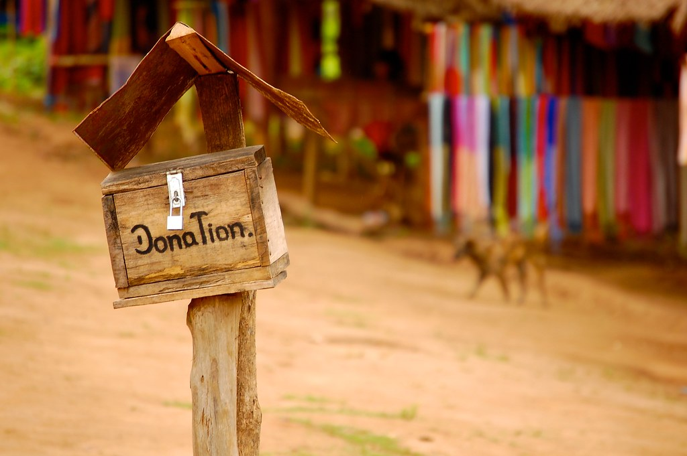

Il y a un peu plus d'un an, nous vous annoncions que Neutrinet s'engageait dans de nouveaux projets. Aujourd'hui, Neutrinet a besoin de votre aide !

Comme annoncé l'année passée, nous poursuivons le développement d'une infrastructure de location de machines virtuelles (VPS) hébergées sur les serveurs de Neutrinet, avec nos propres IPs ! Ce projet s'inscrit dans le cadre d'un projet plus vaste de colocation de notre armoire en datacenter, le projet « Chez Mémé ».

D'autre part, Neutrinet est en phase de devenir un véritable fournisseur d'accès internet associatif pouvant proposer de vraies connexions internet (ce qu'on appelle « la collecte » dans le jargon), à la manière d'un Proximus ou d'un VOO mais avec nos propres équipements et nos IPs !

Ces nouveaux développements ont impliqué pour nous de nouveaux frais, qu'ils soient fixes (1000 € d'achat de matériel) ou récurrents (750 €/mois de frais d'hébergement de nos serveurs, incluant l'électricité, le transit réseau, la location d'espace en datacenter, le monitoring, les backups, etc.) 

Ces frais supplémentaires ne sont pas encore couverts par nos nouveaux projets, car ceux-ci sont encore en phase de test. Ce sont donc pour le moment les revenus de notre service actuel qu'est le VPN (350 €/mois), ainsi que les dons (300 €/mois), qui nous permettaient de couvrir ces coûts... Permettaient, car depuis le début de cette année, nos revenus ne nous permettent plus de faire face à nos dépenses.

Le VPN que nous proposons se fait à prix libre. Nous ne regardons pas qui paie quoi. Neutrinet n'a jamais coupé de service par manque de paiement. 

Néanmoins, le maintient de ce service et de notre infrastructure a un coût, qui est aujourd'hui de l'ordre de 1000 €/mois tout compris. Or, à l'heure actuelle, Neutrinet perd chaque mois environ 300 €. De plus, une bonne partie des dépenses est déjà prise en charge par quelques membres actifs. Il est donc clair que cette situation ne peut pas continuer comme ça.

C'est pourquoi nous venons à vous aujourd'hui avec cet appel aux dons, dans l'espoir de renflouer les caisses en ce moment crucial pour le développement futur de Neutrinet, mais aussi pour rappeler qu'une infrastructure comme celle de Neutrinet suppose des coûts récurrents, et ainsi l'importance de versements réguliers, mensuels et pérennes.

Si nous voulons voir l'avenir sereinement, nous estimons qu'il nous faudrait trouver 600 €/mois. Concrètement, si 30 personnes décidaient de faire un don récurrent de 10€/mois, cela permettrait à Neutrinet de respirer un peu. Si 50 personnes décidaient de nous soutenir, cela permettrait à Neutrinet de continuer ces projets dans la sérénité. N'hésitez donc pas à diffuser cet appel aux dons autour de vous !

Nos informations bancaires se trouvent sur notre wiki : [https://wiki.neutrinet.be/fr/administration/banks](https://wiki.neutrinet.be/fr/administration/banks)

Vous êtes intéressé·e par la location d'une machine virtuelle chez Neutrinet ? Faites-nous signe [par e-mail](mailto:contact@neutrinet.be) ou sur [notre salon Mattermost](https://chat.neutrinet.be/neutrinet/channels/hub-chez-meme) en indiquant combien de machines vous auriez besoin, et le nombre de ressources pour chaque machine (vCPU, RAM, espace disque, etc.). Cela nous permettra de mieux savoir combien de personnes sont intéressées par ce projet. Mais gardez en tête que les machines virtuelles ne seront pas prêtes avant plusieurs mois !

À votre bon cœur !

Neutrinet asbl