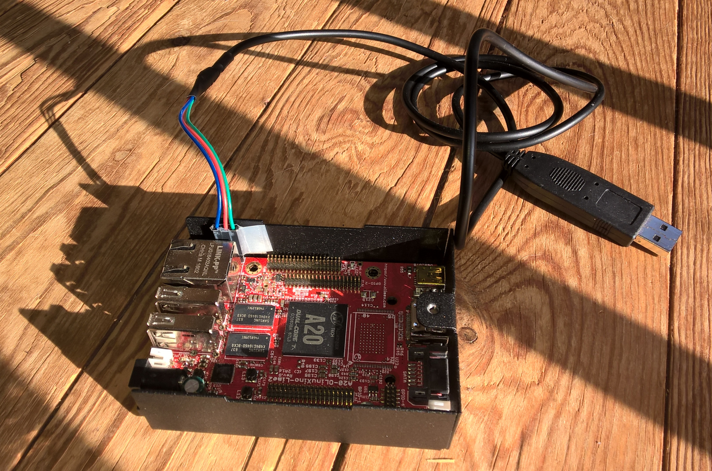

Si vous disposez d'un [câble série](https://www.olimex.com/Products/Components/Cables/USB-Serial-Cable/USB-Serial-Cable-F/) _(USB to serial cable (female))_ ous pouvez l'utiliser pour vous connecter aux cartes Lime1 et Lime2.

===



## Brancher le cable série

### Sur la carte (lime1 ou lime2)

Si vous disposez d'un [câble série](https://www.olimex.com/Products/Components/Cables/USB-Serial-Cable/USB-Serial-Cable-F/) _(USB to serial cable (female))_ ous pouvez l'utiliser pour vous connecter aux cartes Lime1 et Lime2.

À brancher sur les connecteurs UART0 (À côté de la prise ethernet)

* [color=blue]Bleu : GND[/color]
* [color=red]Rouge : TX[/color]
* [color=green]Vert : RX[/color]

Dans l'ordre : vert-rouge-bleu, [autre exemple en photo sur une LIME2](https://blog.chibi-nah.fr/images/netBSD/DSC00952.JPG)

### Sur votre ordinateur

Connectez l'autre côté du câble dans un des port USB de votre PC _(de préférence fonctionnant avec GNU/Linux)_.

## Démarrer un terminal avec screen :

Il y a plusiers possiblilités pour « voir ce qui se passe », ici c'est avec `screen` sur un ordinateur GNU/Linux qui est expliqué.

Pour installer le logiciel `screen` :
```
$ sudo  apt install screen
```

Pour exécuter le logiciel :

```
$ sudo screen /dev/ttyUSB0 115200
```
! Ne vous étonnez pas, si la brique n'est pas allumée le terminal reste noir.

## Fermer un terminal de screen

Utiliser les touches `ctrl+a`, suivi de `k` , et de `y` pour quitter screen.

## Enregistrer ce qui se passe dans un fichier

Le logiciel `screen` peut enregistrer la session dans un fichier `screenlog.0` qui se mettra dans le dossier dans lequel vous démarrer la le terminal.

C'est l'option `-L` qui offre cette possibilité :

```
screen -L /dev/ttyUSB0 115200
```

Et si vous ne savez plus dans quel dossier « vous êtes », vous pouvez utiliser `pwd` avant ou après l'exécution de `screen` :

```
pwd
```

Et pour lire le fichier produit par la session `screen` :

```
more screenlog.0
```

!! Attention si vous exécuter une autre session de srceen, le fichier screenlog.0 sera écrasé!

Renommer ou déplacer le fichier screenlog.0, par exemple :

```
mv screenlog.0 sreenlog.essais-01.log
```

## Allumer la brique

Dés la mise sous tension de votre carte lime1 ou lime2 vous verrez apparaître tout ce qu'elle fait au démarrage.

