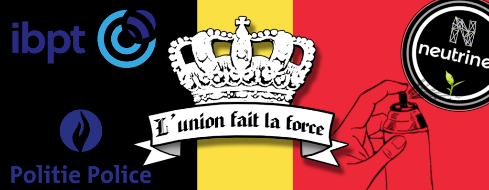
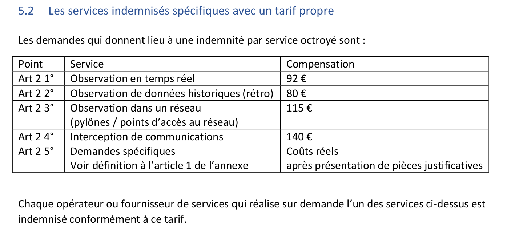

Nous avons jusqu'au 15 octobre 2021 pour constituer une Cellule de Coordination de la Justice, comme nous le rappelle l'IBPT (Institut Belge des Postes et Télécommunications) :

>  Nous vous rappelons que l’obligation de disposer d’une CCJ est régi par l’article 126/1 de la loi du 13 juin 2005 relative aux communications électroniques et par l’arrêté royal du 9 janvier 2003. Cette cellule doit répondre à diverses obligations et, entre-autres, se trouver sur le territoire belge et être accessible 24/7 afin de pouvoir répondre le plus rapidement possible aux demandes émanant des autorités judiciaires.
>
>Dès lors, nous vous saurions gré de bien vouloir répondre à notre demande et mettre à jour les données de votre CCJ pour le 16/09/2021 au plus tard.
>
>Pour rappel, la plateforme est accessible à l’adresse https://nis-incident.be/
>
>Vous pouvez demander les codes d’accès à cette plateforme en adressant un mail au secrétariat du service Sécurité des réseaux (sec_netsec@bipt.be).
>
>Tout manquement à ces obligations légales pourrait faire l’objet de poursuites judiciaires ou administratives.
>
>Nous vous prions d'agréer, Madame, Monsieur, l’expression de notre considération distinguée.

## Neutrinet

Pour rappel, Neutrinet asbl est, pour ainsi dire, le seul Fournisseur d'Accès Internet Associatif en Belgique ([source](https://www.bipt.be/operators/publication/list-of-telecom-operators)).

Nous en avons pris conscience tardivement parce que leur(s) premier(s) mail(s) sont tombés dans les SPAMs.

Nous en avons parlé lors de deux réunions

- [Réunion des membres du 21/09/2021](https://wiki.neutrinet.be/fr/rapports/2021/09-21#ccj)
- [Réunion hub-admin du 29/09/2021](https://wiki.neutrinet.be/fr/rapports/2021/09-29)

Vous devez comprendre que quelqu'un·e chez Neutrinet asbl devra être disponible 24h/24, 7j/7 et 365 jours par an et on ne voit pas comment faire ça.

Cette *(ou ces)* personne(s), doivent subir une enquête de sécurité renouvelable tous les 5 ans.

Et dans le cas où nous constituons cette CCJ, nous pouvons envoyer une factures pour être indemnisés ([source](https://www.ibpt.be/file/cc73d96153bbd5448a56f19d925d05b1379c7f21/4cda9d352da1912b728c4517c70ce9c2de5815c2/Brochure_Informative_Obligations_Collaboration_Autorites_Judiciaires.pdf)).

## Risques pour les gens de Neutrinet ?

Le risque que les administrateurs ou les membres de la CCJ de Neutrinet encourent sont;

* Refus de collaborer ou de collaborer dans le délais requis : 6 mois à un an de prison et/ou amende allant de 26 - 20 000 euros
* Faire disparaître, détruire ou altérer les données dont la conservation est demandée : 6 mois à un an de prison et/ou amende allant de 26 - 20 000 euros
* Non-respect de l’obligation de conservation : amende jusqu’à 50 000 euros.

Sachant qu'à l'heure actuelle Neutrinet ne dispose pas d'un·e permanent·e pour répondre aux exigences de réponse 24h/24 et 7j/7. Ce sont donc des exigences très difficiles à répondre pour l'association.

## Nous avons besoin d'aide

!! Si vous êtes juriste ou avez des contacts avec des juristes ou avocats spécialiser dans les télécom, nous en avons urgemment besoin. 
!! N'hésitez pas à nous rejoindre sur notre [Mattermost](https://chat.neutrinet.be/) ou à nous envoyer un mail à contact @ neutrinet . be.

---

Ci-dessous un extrait de [la brochure informative de l'IBPT](https://www.ibpt.be/file/cc73d96153bbd5448a56f19d925d05b1379c7f21/4cda9d352da1912b728c4517c70ce9c2de5815c2/Brochure_Informative_Obligations_Collaboration_Autorites_Judiciaires.pdf) qui reprend ce qu'un·e enquêteur·ice peut nous demander.

##### 3.12 Fourniture de données d’identification et de données concernant les services fournis

L’opérateur doit fournir à l’autorité requérante les informations concernant :
- L’identification des abonnés ou des utilisateurs de leurs services (données à caractère personnel, adresse, adresse de facturation, contrat...)
- L’identification du moyen de communications électroniques utilisé (par ex. IMEI, IMSI, IP, MAC...)
- L'identification des services auxquels une personne est abonnée ou qui sont habituellement utilisés par une personne

##### 3.13 Fourniture de données de trafic et de localisation

L’opérateur doit fournir à l’autorité requérante les informations concernant :

- L’identification des abonnés ou des utilisateurs de leurs services (données à caractère personnel, adresse, adresse de facturation, contrat...)
- L’identification du moyen de communications électroniques utilisé (par ex. IMEI, IMSI, IP, MAC...)
- L'identification des services auxquels une personne est abonnée ou qui sont habituellement utilisés par une personne

##### 3.14 Obligation d’interception et de fourniture des données interceptées

Un opérateur ou fournisseur de services doit pouvoir transmettre en temps réel les données d’un service de communications électroniques donné dans un langage clair au système central d’interception du NTSU CTIF.

Pour ce faire, l’opérateur ou le fournisseur de services doit connecter son système au système central d’interception du NTSU CTIF. Cette intégration est effectuée en concertation avec le NTSU-CTIF. Dans ce cadre, il y a lieu de passer par DSU.NTSU.CTIF.IT@police.belgium.eu.

La même procédure doit être suivie à chaque fois que des modifications sont apportées à ce système.

L’opérateur reçoit de la permanence du NTSU CTIF les demandes des autorités compétentes accompagnées d’une fiche récapitulative des mesures demandées. Celles-ci doivent être exécutées immédiatement. En cas d’imprécisions ou de problème concernant l’exécution de la requête, l’opérateur est tenu de contacter DSU.NTSU.CTIF.PERM@police.belgium.eu ou de téléphoner au +32 2 642 77 11.

##### 3.15 Synchronisation et précision des heures communiquées

Étant donné que le temps joue un rôle crucial dans les communications électroniques, il est absolument nécessaire que la configuration horaire de tous les systèmes impliqués se synchronise en permanence avec un signal fiable tel qu’une horloge atomique ou le signal GPS.

Si des heures doivent être communiquées pour les données de trafic, celles-ci seront exprimées jusqu’à la seconde.

##### 3.16 Obligation de secret

Toute personne chez un opérateur requis qui prend connaissance de la demande et des données qui constituent la réponse est soumise au secret professionnel.

Cela signifie qu’elle ne peut communiquer aucune information concernant la requête, l’autorité requérante, la demande, la personne concernée, les éléments de la demande, la réponse ou quelque autre information concernant la requête à d’autres personnes que celles appartenant à la CCJ.

S’il est fait appel à des techniciens pour pouvoir satisfaire à la demande, cela a lieu sous la responsabilité de la CCJ et seules les informations strictement nécessaires sont communiquées aux techniciens en question.

Ces techniciens sont également tenus de respecter l’obligation de secret.

!!! Ça ressemble à ce qu'on décrivait dans un [autre article](/blog/collabo) dans lequel il y a un tableau comparatif entre un FAI *(Neutrinet asbl)* et une société de taxi.

---

Les images sont issues de

* L'union fait la force de [sticker express](https://www.stickers-express.fr/belgique/2497-l-union-fait-la-force.html)
* logo IBPT depuis le [site de l'IBPT](https://ibpt.be/bundles/emsch_assets/static/logo-fr-text.svg)
* logo police nationnale depuis le site de [Wikipedia](https://upload.wikimedia.org/wikipedia/uk/thumb/e/ee/%D0%9B%D0%BE%D0%B3%D0%BE%D1%82%D0%B8%D0%BF_%D0%A4%D0%B5%D0%B4%D0%B5%D1%80%D0%B0%D0%BB%D1%8C%D0%BD%D0%BE%D1%97_%D0%BF%D0%BE%D0%BB%D1%96%D1%86%D1%96%D1%97_%D0%91%D0%B5%D0%BB%D1%8C%D0%B3%D1%96%D1%97.png/250px-%D0%9B%D0%BE%D0%B3%D0%BE%D1%82%D0%B8%D0%BF_%D0%A4%D0%B5%D0%B4%D0%B5%D1%80%D0%B0%D0%BB%D1%8C%D0%BD%D0%BE%D1%97_%D0%BF%D0%BE%D0%BB%D1%96%D1%86%D1%96%D1%97_%D0%91%D0%B5%D0%BB%D1%8C%D0%B3%D1%96%D1%97.png)
* spray de [Openclipart](https://openclipart.org/detail/324448/hand-spray-paint)