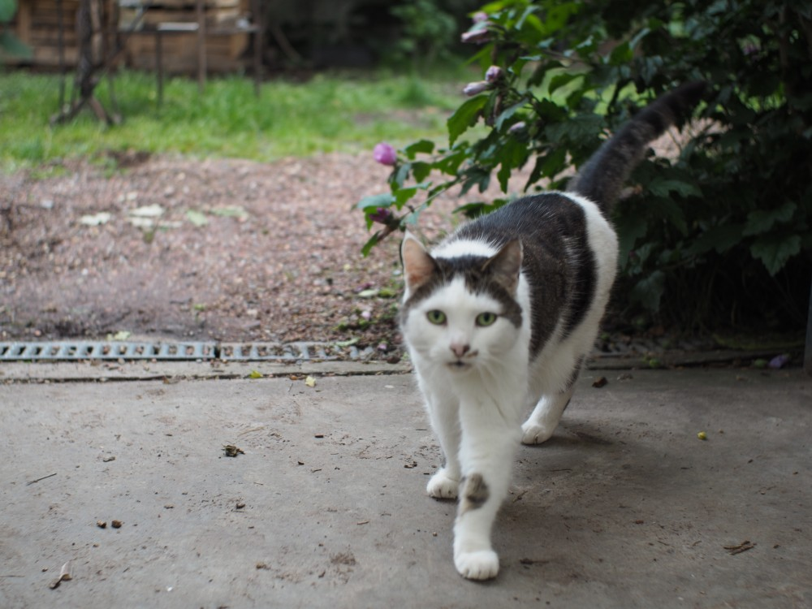
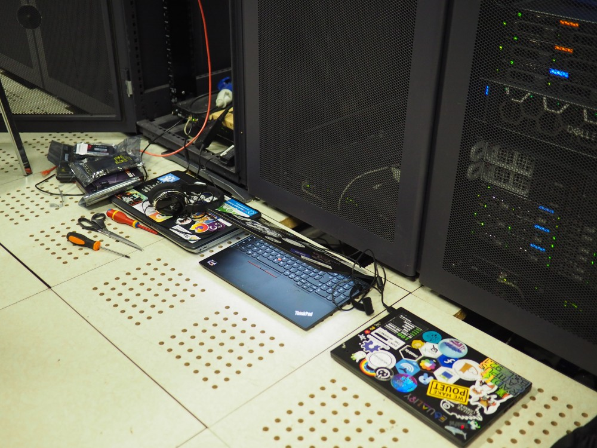

Mi-juin 2022. Le début de l'été est déjà chaud et le week-end des 11 et 12 juin particulièrement ensoleillé. A proximité de LouiseDC, les canards batifolent dans les étangs d’Ixelles et les humains se prélassent sur les pelouses et les terrasses. Mais au sein du datacenter de Verixi, les petites mains de l'infra de Neutrinet s'affairent, pianotant fébrilement dans leur terminal, entourées par les serveurs vrombissants.

L'objectif de cette opération de maintenance ? 

... Chiffrer nos serveurs à Louise DC ! 🔒🪄

## Pourquoi chiffrer nos serveurs ?


Mais au fait, avant de revenir sur cette opération technique...

### Pourquoi cette décision ?

Dans le cadre d'une réflexion générale de longue haleine sur l'infrastructure de Neutrinet et sur les moyens de l'améliorer progressivement, nous avions consacré deux mois plus tôt [un Neutriton sur cette question](https://wiki.neutrinet.be/fr/rapports/2022/04-16). A ce moment-là, nous avions discuté des différentes méthodes de chiffrement que nous pourrions utiliser et tenté de définir un modèle de menace pour Neutrinet. 

### De qui, ou de quoi, cherchait-on à se prémunir ?

Si Neutrinet milite pour la neutralité du net et défend un droit à la vie privée contre la surveillance de masse, notre asbl ne souhaite pas se mettre dans l'illégalité. Ainsi, dans un contexte où la loi belge oblige à fournir les clés de déchiffrement de ses machines en cas de demande du juge d'instruction (sous peine de prison), et ou Neutrinet est assujetti comme opérateur à la nécessité de former une CCJ et à l'impératif de conserver des logs de certaines connexions en cas de requête judiciaire, il est apparu rapidement que notre modèle de menace n'était pas de chercher à nous prémunir de l'Etat.

En revanche, comme nous sommes transparents sur l'emplacement de nos serveurs, et dans la mesure où le projet de colocation de baie de datacenter "Chez Mémé" est appelé à prendre de l'ampleur (entrainant plus de passage et d'accès à notre armoire), il nous semblait pertinent de chercher à protéger nos données contre le vol. Par exemple, dans le cas où une personne trop curieuse retirerait un disque d'un de nos serveurs pour y jeter un œil...

Pour cette raison, nous nous sommes décidés à réinstaller complètement nos serveurs Proxmox en chiffrant leurs disques. 

Par cette méthode, nous rendons impossible la lecture de leurs données par un tiers qui ne dispose pas de la phrase de passe pour y accéder.

## Les choix techniques



Après quelques discussions, notre choix s'est porté sur un chiffrement utilisant [LUKS](https://en.wikipedia.org/wiki/Linux_Unified_Key_Setup) et l'outil en ligne de commande [cryptsetup](https://gitlab.com/cryptsetup/cryptsetup). 

La bible pour comprendre ces outils, c'est [le wiki d'Arch-Linux](https://wiki.archlinux.org/title/Data-at-rest_encryption). Mais, pour résumé, lorsqu'un volume est chiffré, cryptsetup est l'outil qui fait le lien entre la machine et nous pour nous demander de fournir notre phrase de passe. Et si plusieurs volumes sont chiffrés, l'outil va se manifester plusieurs fois pour demander de les déchiffrer successivement.

Dans le cas d'un serveur, qu'on souhaite vite de retour en cas de redémarrage, il est avantageux de ne pas devoir taper successivement plusieurs phrases de passe (par exemple une première fois pour le système, une seconde fois pour la swap, etc...). On a donc modifié la manière dont notre serveur charge le système d'exploitation Debian pour y intégrer notre phrase de passe et permettre le déchiffrement automatique des différents volumes une fois le premier déchiffré. 

Cela se fait en modifiant l'[initramfs](https://www.fr.linuxfromscratch.org/view/blfs-svn/postlfs/initramfs.html), une archive montée en mémoire au démarrage de la machine, qui sera ensuite montée par le noyau à la racine du système de fichier "/".

Cette procédure est d'autant plus utile que l'on doit utiliser l'interface série qui ne supporte pas les copiés /collés... Pour se faciliter la vie, on a aussi généré une phrase de passe humainement lisible en utilisant [un utilitaire permettant de gérer des listes de mots ](https://github.com/mbelivo/diceware-wordlists-fr) aisément mémorisables mais engageant un niveau suffisant d'[entropie](https://fr.wikipedia.org/wiki/Entropie_de_Shannon).

Avec cette méthode, l'ensemble des disque est chiffré, y compris la partition de démarrage du système /boot. Lorsqu'on déchiffre /boot, on libère les clés de chiffrement contenues dans l'initramfs, qui sont utilisées à leur tour pour déchiffrer les autres volumes du système.

Cela signifie-t-il que si un serveur doit redémarrer, il faudra se rendre au datacenter taper cette passephrase ? 

En temps normal, nous n'en auront pas besoin. Dans le cas où l'un des serveurs doit redémarrer, on pourra utiliser le second serveur pour fournir la première phrase de passe et déverrouiller l'initramfs. 

Néanmoins, suite à cette opération, si aucun de nos serveurs n'est accessible (en cas de coupure d'électricité ou si nous perdons nos sessions [BGP](https://fr.wikipedia.org/wiki/Border_Gateway_Protocol), il sera nécessaire  de se rendre sur place physiquement pour redémarrer nos serveurs, ce qui pourra entraîner une interruption plus longue de service.

## Les différents étapes du processus



Depuis son déménagement à LouiseDC en 2020, Neutrinet dispose d'une infrastructure redondante basée sur Proxmox, un [hyperviseur](https://fr.wikipedia.org/wiki/Hyperviseur) permettant d'isoler les différents services de Neutrinet dans des machines virtuelles distinctes (serveur vpn, site web, mattermost, wiki, etc...) mais qui permet aussi aux serveurs de faire une gestion commune de ces machines avec un stockage partagé. Cela s'appelle un "cluster".

Concrètement, cela signifie que les machines peuvent passer d'un serveur à l'autre sans qu'il n'y ait d'interruption de service et c'est pourquoi aucun downtime n'était prévu lorsque les petites mains de l'infra se sont mises à la tâche. L'objectif était de réinstaller les serveurs successivement, en bénéficiant de la redondance pour déplacer les machines sur le serveur fonctionnel et éviter les interruptions. 

L'infra actuelle de Neutrinet est documentée sur [notre wiki](https://wiki.neutrinet.be/fr/infra/notes_sur_infra_de_neutrinet). Concrètement, Proxmox est installé sur deux serveurs 1u : *nam* et *bour*. L'installation est complétée - et surplombée - par un mini pc (de la taille d'un nuc), *topi*, servant à assurer un quorum entre les différents machines. (Oui, topi étant au sommet de l'installation, cela fait bien topi-nam-bour si on lit de haut en bas, vous avez bien compris 😉) 

Pour chaque serveur, la marche à suivre est la suivante : 

* Retirer le serveur du "cluster"

* Formater et chiffrer les disques du serveur

* Réinstaller Debian

* Modifier l'initramfs

* Réinstaller Proxmox

* Réinsérer le serveur dans le cluster.

Au cours de l'opération, il est aussi prévu de profiter de la mise hors tension de nos serveurs pour effectuer quelques améliorations hardware. Pour supporter le passage au un chiffrement des données, plus coûteux en ressources, nous changeons nos HDD pour des SSD. Nous ajoutons également de la mémoire pour passer de 64 Go de RAM à 128 Go de RAM.

Une fois le premier serveur réinstallé revenu dans le cluster (*nam*), un temps de synchronisation est nécessaire avant que le serveur ne soit à même de récupérer les machines virtuelles et qu'il soit possible d'éteindre second (*bour*). 

## Les problèmes rencontrés


Evidemment, tout ne pouvait pas se passer comme prévu et l'opération, qui aurait dû initialement prendre une seule journée, en a pris deux. 

Par ailleurs, contrairement aux prévisions, les services de Neutrinet, dont le VPN, ont tout de même subi une interruption le samedi soir 11/06.

### Trop peu de RAM

Un premier problème que nous avons rencontré dès le début de la matinée était l'impossibilité de migrer l'ensemble de nos machines sur *bour* pour réinstaller *nam* : il manquait de la RAM. Il faut dire qu'être un opérateur du net demande des ressources... On s'aperçoit que nos machines qui gèrent le réseau utilisent déjà 10 Go de RAM ! Ouch !

On décide donc finalement de commencer par migrer toutes les machines virtuelles que nous pouvons sur *nam* afin d'éteindre *bour* quelques instants pour y ajouter les barrettes que nous avons apportées... en coupant le temps de l'opération quelques services que nous jugeons moins critiques (interruption de quelques minutes de backoffice, meta (discourse) et librenms).

Mais une fois *bour* revenu dans le cluster, il doit prendre du temps de se resynchroniser avec le cluster. Nous perdons donc du temps sur l'horaire que nous avions prévu car nous devons attendre pour migrer l'ensemble de nos VM sur *bour* et pouvoir réinstaller *nam*.

### Compatiblité de CEPH entre deux versions de Proxmox

Bien que la manipulation ait été opérée sur les serveurs de *Chez Mémé* quelques jours avant avec des configurations similaires, nous nous sommes trouvé en difficulté au moment de réinsérer *nam* dans le cluster. Nos deux Proxmox installés en 2020 utilisaient la version 6 de Proxmox. Cependant, en juin 2022, la version 7 est sortie, embarquant une nouvelle version de [CEPH](https://fr.wikipedia.org/wiki/Ceph), la solution de stockage distribué que nous utilisons pour partager le stockage de nos machines virtuelles entre les deux serveurs Proxmox. Et cette version 16 "Pacific" de CEPH utilisée par Proxmox 7 crée des problèmes de compatibilité avec la version précédente.

Nous tentons de trouver une solution au problème en upgradant la version de CEPH sur *bour* et *topi*, mais nous nous retrouvons avec un "moniteur" fantôme, hérité de la première tentative de retour dans le cluster quand les versions de CEPH étaient différentes. Celui-ci a été ajouté mais n'est pas reconnu ni pleinement configuré, et on ne parvient pas à supprimer.

Après beaucoup de temps et une invocation de Chtulluh (si si, c'est sur le pad des notes de l'opération), on finit par trouver l'incantation qui dépossède de ses pouvoirs le moniteur fantôme : 

```bash
ceph --admin-daemon  /var/run/ceph/ceph-mon.nam.asok sync_force --yes-i-really-mean-it
```

Par la suite, quelques manipulations ont encore été nécessaire pour résoudre un problème de permissions car *bour* et *topi* communiquaient encore avec un ancien protocole (on a fini par tuer le processus, remis les bons droits au moniteur et redémarré le service). 

Finalement pu lancer la migration des VM vers *nam* pour pouvoir procéder à la réinstallation de *bour*.

### Redémarrage imprévu de nam

Au moment de retirer *bour* du cluster, *nam* a redémarré de manière imprévue. C'est pourquoi bien que l'opération aurait du se dérouler sans downtime pour les utilisateur•trice•s des services de Neutrinet... ceux-ci se sont tout de même retrouvés inaccessibles dans la soirée du samedi.

Au moment où *nam* a redémarré, nous n'avons pas tout de suite soupçonné un redémarrage et nous avons plutôt suspecté un problème réseau. 

Quand nous nous sommes aperçu de ce qui s'était passé, nous avons du redémarrer une nouvelle fois le serveur pour avoir accès la console (qu'il faut activer avant que grub ne s'affiche) et taper notre phrase de passe. Mais même une fois la console activée, nous avons rencontré des difficultés à taper la phrase de passe en raison d'un souci graphique lié à la taille du terminal.

Cela nous aura permis de tester en situation le redémarrage du serveur en tapant la phrase de passe suite à un crash... mais cela a entraîné un downtime imprévu d'une demi heure environ.

Au redémarrage, nous avons aussi quelques soucis avec Proxmox qui ne démarrait pas convenablement et ne communiquait plus avec *topi*. Comme il se faisait tard et que la réinstallation de *topi* et de *bour* allait être faite le lendemain, le problème a été résolu en indiquant à *nam* qu'il était seul dans le cluster proxmox.

### Perte du clavier en réinstallant bour

En réinstallant *bour* le dimanche, nous avons rencontré un souci lors de l'installation avec le clavier qui n'était plus détecté au moment où l'ISO s'est lancé.

## Bilan de l'opération

L'opération de maintenance, qui était prévue le samedi 11 juin, s'est finalement étalée sur l'ensemble du weekend en raison de différents problèmes rencontrés. 

Un downtime imprévu a eu lieu le samedi en soirée.

Mais à l'issue de ces manipulations :

* Les trois serveurs de Neutrinet ont leurs disques qui sont chiffrés

* Le système des serveurs est désormais installé sur des SSD

* La mémoire RAM des serveur est passée de 64GB à 128GB 

* Les serveurs utilisent une version plus à jour de Proxmox et de CEPH

Durant le week-end, nous avons également changé un SSD d'un serveur de Chez-Mémé.

Le détail des manipulations techniques peuvent être retrouvé [sur notre wiki](https://doc.neutrinet.be/hib-dc-2022-06-11?view#).
