## Objectifs

  * Enregistrer un [Nom de domaine](https://fr.wikipedia.org/wiki/Nom_de_domaine) de `votre-choix.etc` ou de `votre-choix.noho.st` ou de `votre-choix.nohost.me`
  * Obtenir un [VPN](/vpn) de Neutrinet asbl avec une adresse IPv4 et un */64* IPv6.
  * Installer [Yunohost](https://yunohost.org) sur un ordinateur de récupération.
  * Installer le [VPN Client](https://github.com/labriqueinternet/vpnclient_ynh) sur votre Yunohost.

## Nom de domaine

Lors de son installation Yunohost demandera « quel est votre domaine ? ».  Si vous n'en avez pas Yunohost vous proposera d'en créer un nouveau au format ```votre-choix.noho.st, votre-choix.nohost.me, etc```.

Mais si vous préférez avoir un nom de domaine ```votre-choix.be, votre-choix.com, votre-choix.ninja, etc``` alors il vous faudra enregistrer un nom de domaine auprès d'un [registrar](https://fr.wikipedia.org/wiki/Registraire_de_nom_de_domaine) et payer la redevance annuelle. Vous en serez alors le ou la contact·e *propriétaire, technique, administratif, facturation*.  Si vous oubliez de renouveler votre nom de domaine ```votre-choix.etc```, il sera mis en quarantaine pendant 40 jours avant d'être remis sur le marché. 

Neutrinet asbl peut enregistrer pour vous, chez [Gandi](https://gandi.net), un nom de domaine de ```votre-choix.etc``` et en être le contact *propriétaire, administratif,technique et facturation*. Nous faisons cela par facilité et par paresse mais si vous tenez à être *propriétaire* de ```votre-choix.etc``` et laisser Neutrinet asbl en être le contact *administratif, technique et facturation*, il va de soi que nous feront les démarches avec vous pour vous désigner en tant que contact *prorpiétaire*.

Pour éviter un travail ultérieur de *transfert* du contcat *propriétaire*, lors de l'enregistrement nous auront besoin de vos coordonées complètes telles que le type d'organisation *(particulier, association,…)* et numéro d'entrerpise le car échéant, nom, prénom, adresse, pays, ville, numéro de téléphone et email.


## VPN

Faire l'[auto-hébergement](https://fr.wikipedia.org/wiki/Auto-h%C3%A9bergement) de son serveur mail chez soi sans une adresse IP fixe *(ipv4 et ipv6)* c'est impossible.  En effet le [SMTP](https://fr.wikipedia.org/wiki/Simple_Mail_Transfer_Protocol) ne fonctionnera pas correctement si le serveur mail de ```votre-choix.etc``` change d'adresse réguliérement ou, pire encore, parceque les Fournisseurs d'Accès Internet ont pris la décision technique de bloquer l'accès au [port 25](https://fr.wikipedia.org/wiki/Simple_Mail_Transfer_Protocol#Blocage_du_port_25_par_les_fournisseurs_d'acc%C3%A8s) de votre connexion Internet sur une **connexion à usage personnel**.

Avec un FAI, autre que Neutrinet asbl, vous pourrez obtenir l'ouverture de ce port 25 et l'obtention d'adresses IP fixes avec une **connexion à usage professionnel** et donc d'une personne morale *(asbl, sprl, indépendant·e, etc)*.  Nous n'avons pas testé les conditions de tout les FAI et il existe peut-être un FAI qui propose ces possibilités à des particuliers.

Le VPN de Neutrinet asbl, en plus de fournir un [tunnel VPN](https://fr.wikipedia.org/wiki/R%C3%A9seau_priv%C3%A9_virtuel) qui chiffrera la communication aux yeux de votre FAI existant, vous fournira ces précieuses adresses IP *(v4 et v6)* en ouvrant tout les ports [TCP]](https://fr.wikipedia.org/wiki/Transmission_Control_Protocol) et [UDP](https://fr.wikipedia.org/wiki/User_Datagram_Protocol) y compris les ports dont le [SMTP](https://fr.wikipedia.org/wiki/Simple_Mail_Transfer_Protocol) à besoin pour founctionner correctement.

En résumé, sur une connexion Internet à usage personnel existante *(et donc un peu moins onéreuse qu'une connexion à usage professionnel)*, votre serveur  disposera d'une sorte de « seconde connexion » qui l'exposera sur Internet avec une adresse IPv4 et un range IPv6 *(/64)* et dont tous les ports seront accessibles et non filtrés dans le respect de la [neutralité du net](https://fr.wikipedia.org/wiki/Neutralit%C3%A9_du_r%C3%A9seau) que nous défendons.


### Créer un fichier `auth`

#### Objectif

  * avoir un fichier `auth` dans votre dossier `neutrinet` sur votre ordinateur personnel.

> Bien qu'il soit possible de réaliser une partie des tâches décrites ci-dessous avec un ordinateur non libre *(Microsoft® ou Apple®)), nous recommandons l'utilisation d'un ordinateur fonctionnant avec un [système d'exploitation](GNU/Linux).

Sur un ordinateur **personnel** fonctionnant avec GNU/Linux, nous allons créer un dossier local au nom de votre compte Neutrinet qui rassemblera les fichiers dont que nous allons créer et télécharger depuis votre compte Neutrinet, à savoir `auth, client.key, CSR.csr, client.crt, ca.crt, neutrinet.ovpn, neutrinet.cube`. Les fichiers qui se trouveront dans ce dossier sont **des données précieuses et personnelles**, tâchez d'en prendre soin, d'en conserver une copie et d'en limiter l'accès ou la diffusion à vous seul ou des personnes de confiance.

Ouvrez un [terminal]() et rendez vous, par exemple, dans votre dossier personnel `/home/vous` ou votre dossier Documents `/home/vous/Documents`.

```
cd ~             # ou bien cd ~/Documents à votre convenance
mkdir neutrinet  # créer un dossier neutrinet 
cd neutrinet     # rentrer dans le dossier neutrinet
```

Créer un fichier `auth`.

```
nano auth        # nano étant un éditeur de fichier
```

Dans ce fichier `auth`, nous allons écrire sur la première ligne le *login* de votre futur compte Neutrinet et sur la seconde ligne, la *phrase de passe* de ce futur compte.

```
une.adresse@mail.xyz
une phrase de passe ou un mot de passe du genre Srilu43jnajPazwGHunaw9enulbYQunjzwPab912tsA42
```

Pour quitter `nano` et enregistrer votre nouveau fichier `auth` utilisez les touches `CTRL+X` suivi de `o` *(la lettre O en minuscule)* suivi de `ENTER` *(la touche Enter)*.

### Créer un compte chez Neutrinet

!!!! Lors de cette opération vous allez définir des **éléments importants** comme 
!!!!
!!!!  * le mot de passe de votre compte neutrinet, qui est en même temps le mot de passe de votre VPN
!!!!  * le fichier `client.key` qui est votre clé de chiffrement **privée**

#### Objectif

  * avoir un compte chez Neutrinet
  * avoir votre clé privée `client.key` et générer une demande de certification `CSR.csr` dans le dossier `neutrinet` de votre ordinateur personnel
  * avoir un client VPN chez Neutrinet
  * avoir une adresse IPv4 *(/32)*

Suivre les explications [Créer / commander un VPN de Neutrinet](https://wiki.neutrinet.be/fr/vpn/vpn-order) et lors de la création du compte, **ne jamais revenir en arrière** parce que l'outil d'enregistrement est un peu capricieux.

Au terme de l'enregistrement, si aucune IP n'apparaît, attendre 5 ou 6 secondes et cliquer sur le « Bouton IPv4 ».  Laissez l'IPv6 tel qu'il est.

### Adresses IPv6

Lors de l'étape précédente, il est fort probable que le `client vpn` qui aura été créé en même temps que votre `compte neutrinet` dispose d'une IPv4 *(/32)*, une IPv6 *(/128)* mais pas de *(/64)* IPv6.

#### Objectif

  * avoir un range IPv6 *(/64)*

Il faut se rendre sur [l'outil de gestion de compte de Neutrinet](https://user.neutrinet.be), se connecter en utilisant le contenu du fichier `auth` précédemment créé.

Une fois connecté, cliquer sur le nom de votre client de configuration *(Clients > Common Name)*.

Ensuite sur  *Modify IP Lease Assignement*.

Cliquer à nouveau sur le nom de votre client de configuration *(Choose client > CommonName)* et normalement sous *Choose IP lease* vous devriez voir apparaître votre IPv4.

Cliquer alors sur *Add IPv6 subnet lease*, choisir un /64 au lieu du /128 et pousser sur le bouton « Assign ».  On dirait que rien ne se passe, mis à part une sorte de rapide rafraichissement de la page.

Retourner sur *Overview*, cliquer à nouveau sur le nom de votre client de configuration et maintenant vous devriez voir un range IPv6 dans le IP subnet lease.

### Fichiers de configuration

Pour qu'un `client vpn` Neutrinet soit complet, il faut télécharger un ensemble de fichiers que le seurveur de Neutrinet génèrera pour vous.

#### Objectif

  * avoir un certificat personnel signé par Neutrinet `client.crt` dans le dossier `neutrinet` de votre ordinateur personnel
  * avoir un certificat authentifiant le serveur de Neutrinet `ca.crt` dans le dossier `neutrinet` de votre ordinateur personnel
  * avoir un fichier de configuration OpenVPN fonctionnel `neutrinet.ovpn` dans le dossier `neutrinet` de votre ordinateur personnel
  * avoir un fichier .cube pour faciliter la configuration du [VPN Client]() de [Yunohost]() neutrinet.cube  dans le dossier `neutrinet` de votre ordinateur personnel

Il faut se connecter avec le login / pass définis dans le fichier `auth` sur le [serveur de Neutrinet](https://user.neutrinet.be) pour y télécharger le paquet de configuration *(Download config package)*.  C'est un fichiers `zip` qui contient des fichiers que vous pourrez extraire dans votre dossier `neutrinet` *(cf plus haut; créer un fichier auth)*.

Ce sont les fichiers `client.crt, ca.crt`, cela complètera les fichiers nécessaires pour faire fonctionner un client OpenVPN, à savoir `auth, client.key, client.crt, ca.crt`.  Accessoirement il y a aussi le fichier `neutrinet.ovpn` mais il y **manque les trois lignes suivantes** pour en faire un ensemble de fichiers utilisables par OpenVPN, quelque soit l'ordinateur client *(Mac, Windows ou GNU/Linux)* avec le logiciel [client OpenVPN]().  Pour l'installation de Yunohost et du VPN Cliens de Yunohost, nous n'utiliseront pas le `neutrinet.ovpn` mais nous feront ci-dessous un `neutrinet.cube`.

```
cipher AES-256-CBC
tls-version-min 1.2
auth SHA256
```

### Générer le neutrinet.cube

Pour pouvoir « faciliter » la configuration de l'application `VPN Client` de votre futur Yunohost, il sera plus simple d'utiliser un fichier `neutrinet.cube` qui contiendra l'ensemble des fichiers et même que le contenu du fichier `auth` créé au début de ce document.

#### Objectif

  * avoir un fichier .cube pour faciliter la configuration du [VPN Client]() de [Yunohost]() neutrinet.cube  dans le dossier `neutrinet` de votre ordinateur personnel

Depuis le dossier `neutrinet` de votre ordinateur personnel, dossier qui devrait maintenant contenir les fichiers suivants `auth, client.key, client.crt, ca.crt` *(accessoirement `neutrinet.ovpn`)* et peut-être d'autres, il faut télécharger un script :

```
cd ~/neutrinet # ou cd ~/Documents/neutrinet en fonction de votre choix
wget https://git.domainepublic.net/Neutrinet/scripts/-/raw/master/cubefile/faire_un_point_cube.sh
```

Et l'exécuter.

```
bash faire_un_point_cube.sh
```

Ce qui devrait sortir un nouveau fichier `neutrinet.cube` que nous utiliserons dans l'application VPN Client du Yunohost.

Vous pouvez vérifer si vous avez ce fichiers en listant le contenu de votre dossier `neutrinet`.

```
cd ~/neutrinet # ou cd ~/Documents/neutrinet en fonction de votre choix
ls -lrt
```

## Debian 10.x

Nous allons installer Yunohost sur un ordinateur, comme par exemple,

- une tour *(consommera ±80w)*
- AMD Athlon X2, 
- 2GB RAM(4x512MB DDR2)
- 250GB SSD 
- 500GB HDD pour les backups

>Si la consommation électrique vous pose problème et que de modestes performances vous satisferaient, alors optez pour une [brique internet](/brique).

!!!! Lors de cette installation vous allez définir des **éléments importants** comme 
!!!!
!!!!  * le mot de passe `root`
!!!!  * un compte utilisateur `bidon` pour avoir un·e premier·ière utilisateur·ice sur votre debian et son mot de passe.

Lors de l'installation, vous pouvez donner un nom de machine temporaire, comme par exemple `buster` et ne pas mettre de nom de domaine.  Cela se fera par Yunohost lors de la « post install », une étape qui aura lieu plus loin.

#### Objetif

  * avoir un ordinateur qui fonctionne avec Debian 10 *(Buster)*

### Installation de Debian 10

Installer une Debian 10.x sur un ordinateur avec seulement les paquets `ssh` et `utils` *(les deux derniers de la liste lorsqu'elle vous sera proposée)*.  Pas de bureau Gnome, Kde ou autre, ni de serveur web, etc. Cela sera installé plus tard avec le script de Yunohost.

Si vous ne l'avez jamais fait, il y a une [documentation complète](https://www.debian.org/releases/stable/amd64/index.fr.html) qui pourrait vous aider.

En gros, ma revient à télécharger une image `iso` de Debian 10, d'en faire une clé usb bootable, de démarrer l'ordinateur cible depuis cette clé usb bootable et de suivre l'assistant d'installation.

> Dans le cas de la configuration donnée en exemple, le système sera installé sur une seule pardition du premier disque (sda) et le second disque sera formaté en `ext4` pour être monté plus tard, après que Yunohost soit fonctionnel, sur `/home/yunohost.backup`.

!! Merci de préférer un nom d'utilisateur autre que « le votre » pour l'installation de Debian *(par exemple debian, toto, bidule, etc)* mais en tout cas **pas admin ni le nom que vous donnerez à votre *premier utilisateur yunohost***.
!!
!! En effet, lorsque Yunohost s'installera il créera un compte `admin` et vous demandera un nom pour votre premier utilisateur·ice.  Si c'est le même que celui que vous auriez choisi lors de l'installation du Debian, **cela ne fonctionnera pas**.

## Yunohost

!!!! Lors de cette installation vous allez définir des **éléments importants** comme 
!!!!
!!!!  * le mot de passe `admin` de votre Yunohost
!!!!  * votre premier compte utilisateur·ice sur votre Yunohost et son mot de passe.

#### Objectif

  * avoir un Yunohost installé **sans** faire la post-installation

### Installation de Yunohost 4.x

L'installation Yunohost se fait avec le curl|bash comme indiqué dans [ce tutoriel](https://yunohost.org/fr/install/hardware:vps_debian)

Depuis le terminal de votre Debian 10, cela revient à exécuter la commande suivante,

```
curl https://install.yunohost.org | bash
```

Si `curl` n'est pas installé, vous pouvez l'ajouter et recommencer la commande ci-dessus.

```
apt install curl
```

! L'installation de Yunohost est prévue pour **administrer entièrement votre serveur** et va donc vous demander si vous êtes d'accord que les outils comme `postfix`, `ssh`, `mysql`, etc soit configurés pour être exploiter pour votre nouvel outil d'administration, à savoir Yunohost.

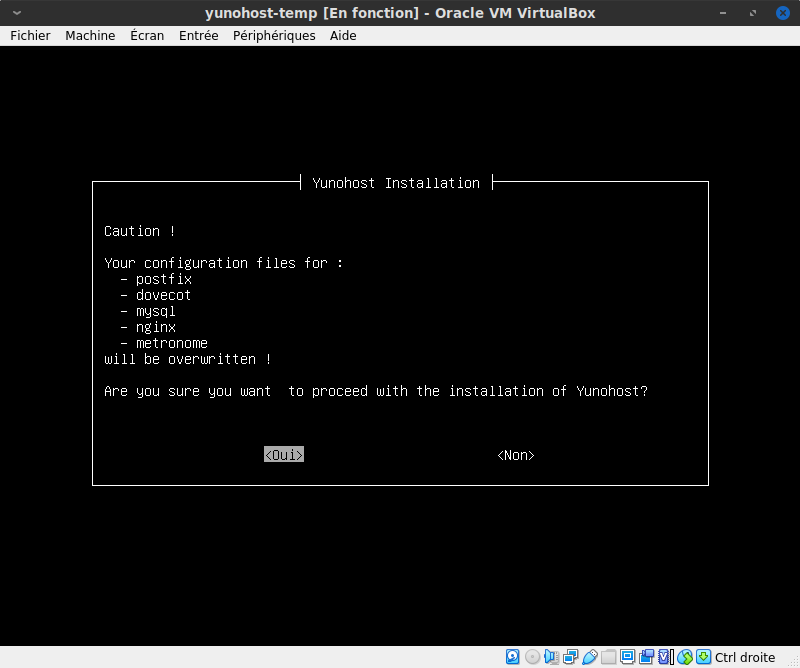


### Noter l'adresse IP locale

À la fin de l'installaton, un message vous renseignera sur l'adresse IP locale de votre seurveur Yunohost.  Notez là bien parce que nous allons en avoir besoin pour poursuivre l'installation.

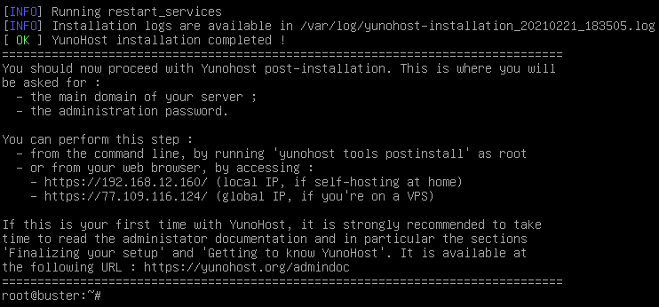

### Post Installation

La post installation de Yunohost va vous permettre de configurer votre premier domaine.

#### Objectif

  * avoir un domaine par défaut configuré sur le Yunohost
  * avoir un mot de passe d'administration *(admin)* pour le Yunohost
  * avoir un premier compte utilisateur·ice et son mot de passe sur le Yunohost

Maintenant que votre serveur Debian 10 a été enrichi par Yunohost, il nous faut maintenant faire la *post installation*.  Cela se fait dans votre navigateur Internet, comme par exemple [Firefox](https://firefox.com) en vous rendant à l'adresse renseignée lors de la fin de l'installation.  Dans notre cas c'était `https://192.168.12.160`.

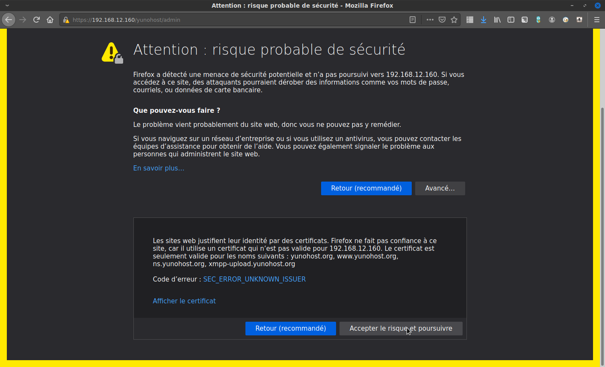

! Ne craignez pas d'accepter le certificat auto-signé de votre nouveau serveur, c'est un avertissement que signale qu'aucune [autorité de certification](https://fr.wikipedia.org/wiki/Autorit%C3%A9_de_certification) ne peut authentifier la provenance du certificat SSL de votre nouveau serveur.  C'est normal puisque dans son cas, il est nouveau et que nous n'avons pas encore fait appel à une autorité comme nous le feront plus tard avec [Let's Encrypt](https://fr.wikipedia.org/wiki/Let%27s_Encrypt).  Cela fait partie de la gestion des nom de domaine et des outils existent dans Yunohost pour nous y aider.

### Domaine par défaut

Pour plus tard, pouvoir facilement héberger un site sur le domaine `votre-choix.etc`, il est préférable de renseigner un sous-domaine comme `admin.votre-cheix.etc` ou `srv.votre-choix.etc` en tant que domaine principal de votre serveur Yunohost.  Ça porte un peu à confusion, mais ce sera plus facile lorsque vous souhaiterez mettre en place un site web sur l'adresse `https://votre-choix.etc`.

> Exemple de domaines : serveur.votre-choix.etc ou admin.votre-choix.etc ou encore console.votre-choix.etc ou nimportequoi.votre-choix.etc.

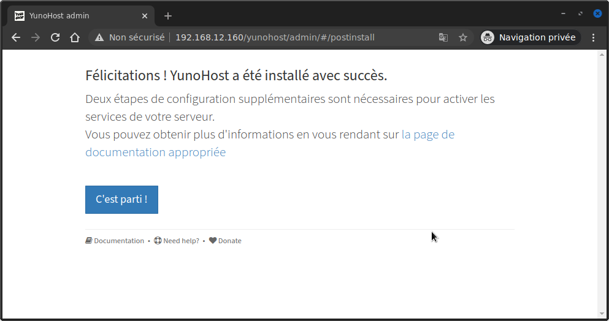
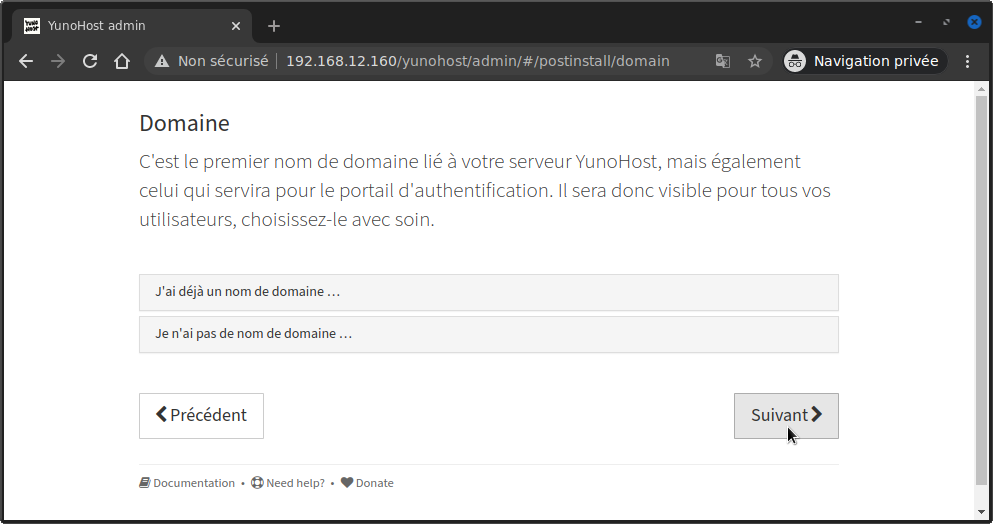
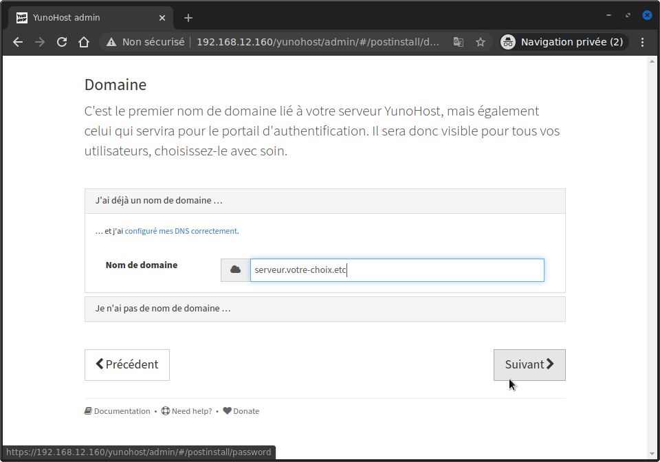
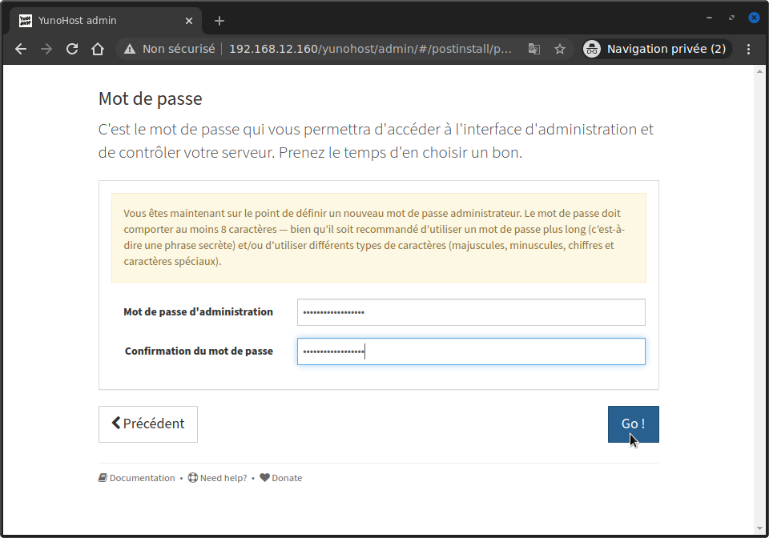
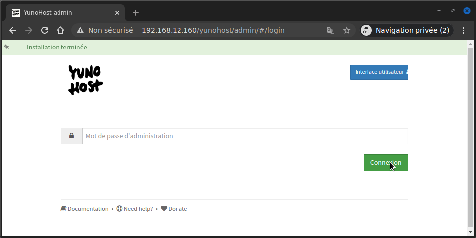


### Autres domaines

Pour générer une configuration DNS qui prendra en charge `*.votre-choix.etc` *(tout ce que vous voudriez ajouter devant .votre-choix.etc)* il faut avant tout ajouter le domaine `votre-choix.etc` dans votre Yunohost.

  * Wordpress, SPIP ou une Custom Webapp *(un site web)* : `votre-choix.etc` pour que ce soit « l'adresse la plus courte qui affichera votre « vitrine ».

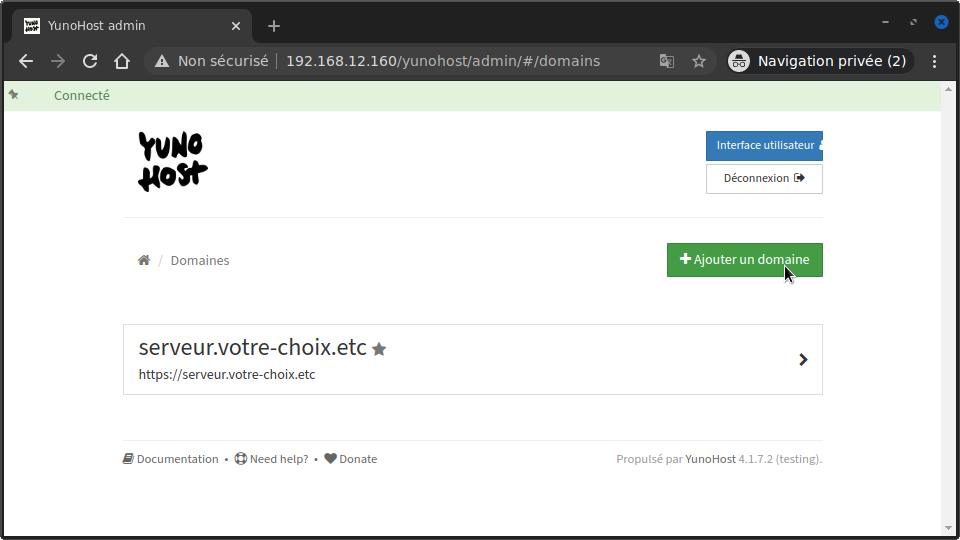
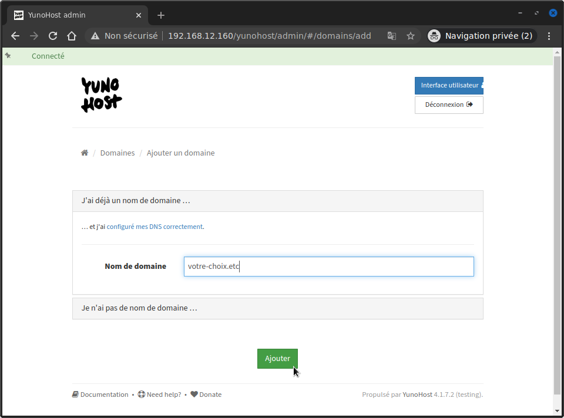
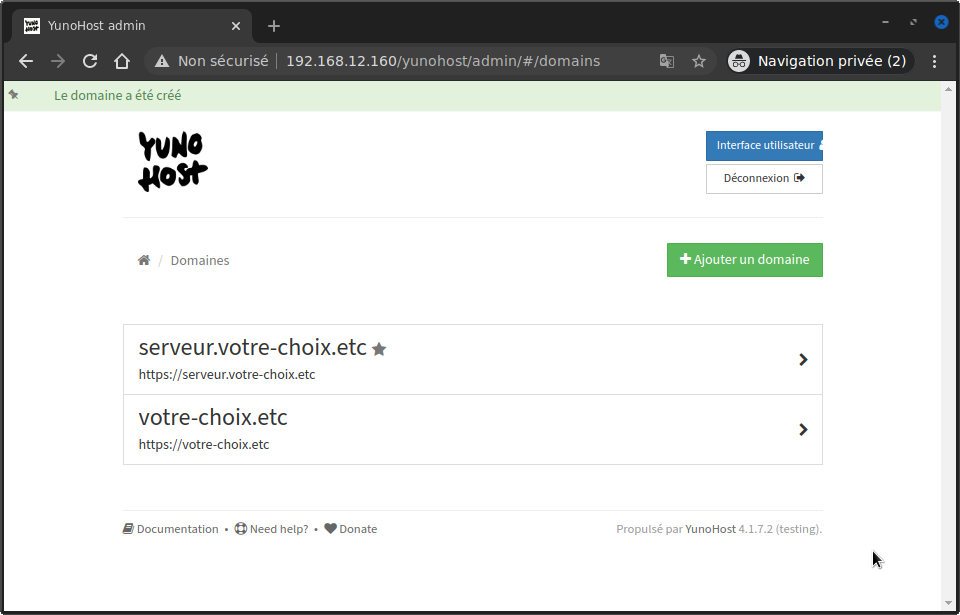

Pour installer des applications directement sur un sous domaine qui leur sera dédié, voici quelques propositions.

  * Roundcube ou Rainloop *(un webmail)* : `mail.votre-choix.etc` ou `lettre.votre-choix.etc` ou ce que vous voudrez.
  * Nextcloud *(un serveur de fichiers, agenda, carnet d'adresses, etc)* : `cloud.votre-choix.etc` ou `racine.votre-choix.etc` ou ce que vous voudrez.
  * Dokuwiki *(un wiki)* : `wiki.votre-choix.etc` ou `souvenirs.votre-choix.etc` ou ce que vous voudrez.

Vous pourrez donc créer différents nom de « sous-domaines » fonction de vos besoins.

> Il est à noter que votre serveur Yunohost peut gérer d'autres domaines ou sous-domaines que `votre-choix.etc` comme par exemple `autre-domaine.xyz`.

### Premier·ière utilisateur·ice.

Créer un premier compte qui sera considérer comme un compte « administrateur d'applications ».  En effet, lors de l'installation de Debian *(cf. plus haut)*, deux comptes sont créés, tout premier compte c'est `root`, puis `bidon` et lors de l'installation de Yunohost c'est `admin` qui est automatiquement créé et enfin, dans notre cas nous aurons `vous` *(ce sera votre compte sur votre serveur Yunohost pour vos mails et l'accès aux applications)*.

Dans l'interface d'administration de Yunohost, il n'y a actuellement aucun compte utilisateur·ice.

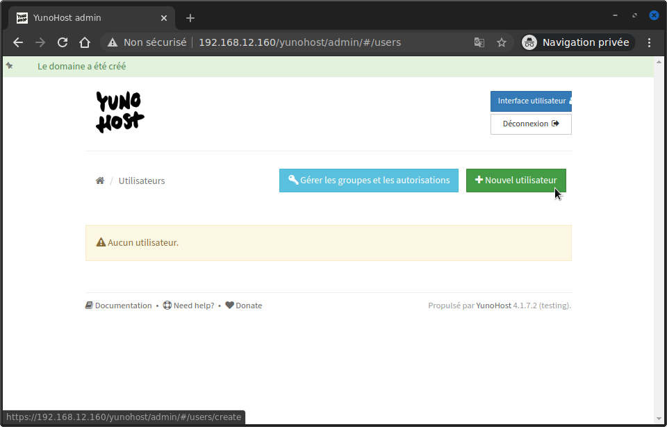

Nous allons donc en créer un pour `vous`.

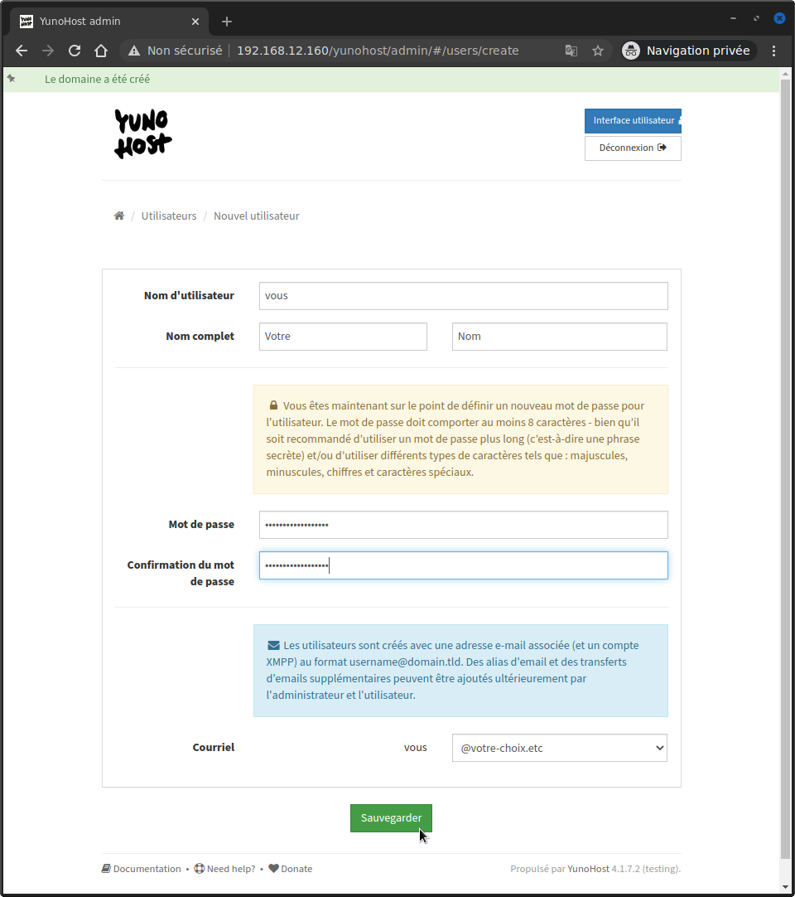

Et maintenant vous avez votre premier compte utilisateur !

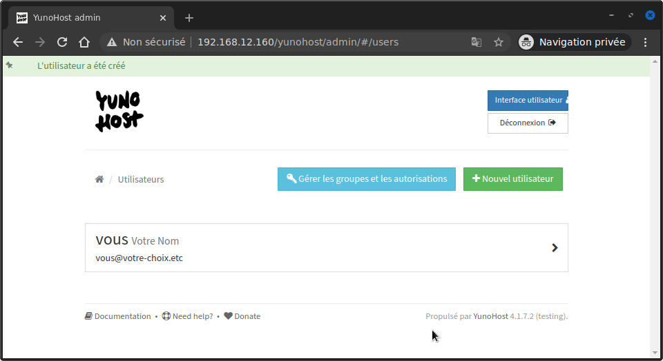

C'est pour pouvoir installer le .cube.

### Installer VPN Client

Pour que votre serveur Yunohost dispose d'adresses IPv4 et v6 **fixes et non filtrées** par votre Fournisseur d'Accès Internet (FAI) *physique*, nous allons installer le VPN de Neutrinet, votre FAI *virtuel*, sur le serveur.  

#### Installer l'application Client VPN

Cela se passe dans l'interface d'administration de votre Yunohost dans la catégorie Applications où il n'y a actuellement encore aucune application installée.

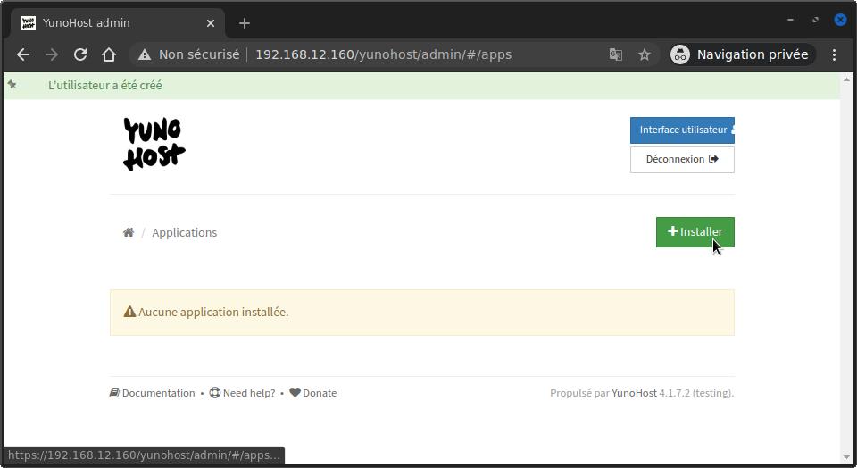

Nous allons chercher après le terme `vpn`.

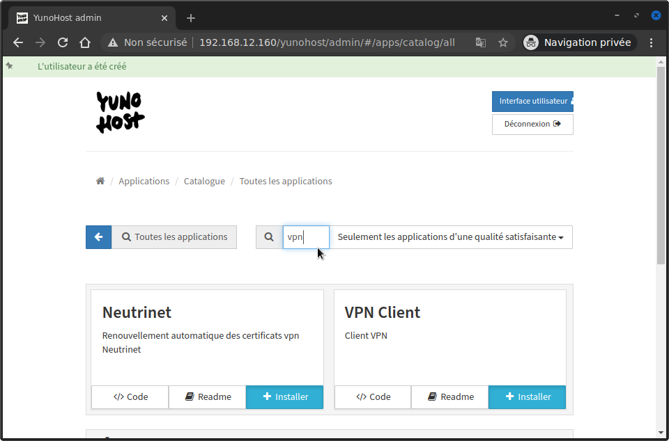

Et installer l'application `VPN Client`.

!! Attention par défaut c'est sur `votre-choix.etc` que cela sera installé, mail si vous espérez un jour héberger un site web sur l'adresse `https://votre-choix.etc` ça sera compliqué.  
!!
!!**C'est pour ça que nous avons mis comme domaine principal `serveur.votre-choix.etc` lors de la post installation de Yunohost** et c'est donc cette option qui est recommandée dans ce tuto.

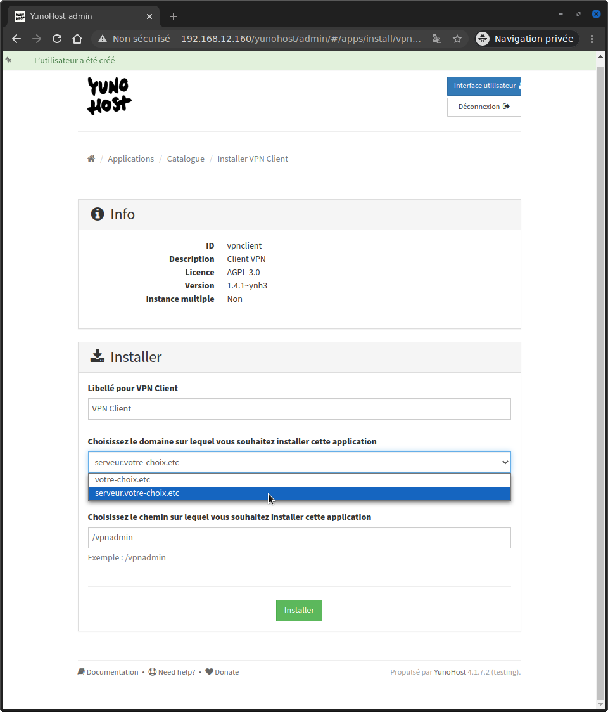

Laissez la magie de Yunohost oppérer et à la fin de l'installation, si tout c'est bien passé, vous aurez votre première application installée !  Whouhouuu \o/

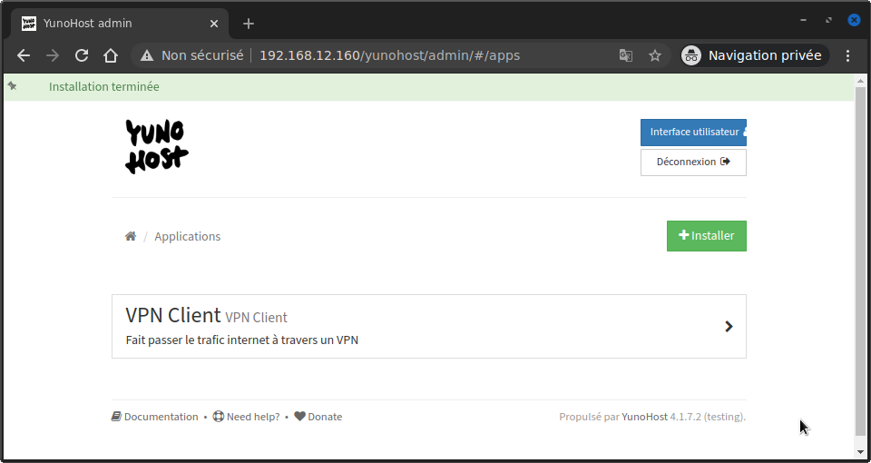


#### Envoyer le `neutrinet.cube` sur le serveur

Maintenant que votre serveur Yunohost fonctionne et qu'il est équipé de sa première application *(VPN Client)*, nous allons encore chipotter un peu pour pouvoir lui soumettre la configuration pour le VPN de Neutrinet, en utilisant le fichier `neutrinet.cube` que nous avons créé dans le début de ce tutoriel.

Depuis le dossier `neutrinet` de votre ordinateur personnel nous allons envoyer le `neutrinet.cube` sur votre serveur Yunohost.

Pour cela nous utiliseront la commande `scp` et l'adresse IP LAN de votre serveur, la même que celle que nous utilisons depuis la fin de l'installation de Yunohost.

Depuis votre ordinateur personnel, dans un terminal,

```
cd ~/neutrinet # ou cd ~/Documents/neutrinet en fonction de votre choix
scp neutrinet.cube admin@IP-LAN-DU-SERVEUR:.
```
Le fichier sera copié vers `/home/admin/neutrinet.cube` sur votre serveur Yunohost.

#### Utiliser le `neutrinet.cube` pour VPN Client

Nous allons maintenant utiliser `ssh` pour se connecter à un terminal sur le Yunohost parce que l'importation du fichier `neutrinet.cube` se fera, comme on dit, à la ligne de commande.

Depuis votre ordinateur personnel, dans un terminal,

```
ssh admin@IP-LAN-DU-SERVEUR # il vous sera demandé de taper le mot de passe pour le compte admin de votre Yunohost
```

Et lorsque vous serrez conneté·e, vous pourrez vérifier si le fichier `neutrinet.cube` est bien présent sur votre serveur Yunohost.

Depuis le terminal de votreu serveur Yunohost,

```
ls -lrt neutrinte.cube
```

Ce qui devrait vous retourner le résultat suivant.

```
total 12
lrwxrwxrwx 1 admin 1007    6 Feb 15 23:51 media -> /media
-rw-r--r-- 1 admin 1007 8799 Feb 23 11:09 neutrinet.cube
```

Si l'application `VPN Client` a bien été installée *(cf. plus haut dans ce tutoriel)*, un script d'importation de fichiers `.cube` est disponible sur le seurver Yunohost, c'est `ynh-vpnclient-loadcubefile.sh`.

Il faudra remplacer `USER-LOGIN` par le nom d'utilisateur de votre compte personnel sur votre Yunohost, dans le tutoriel nous avons utilisez `vous` et remplacer également `USER-PASSWORD` par le mot de passe de ce compte.  Il s'agit bien du premier compte utilisateur·ice et non du compte `admin`.

```
ynh-vpnclient-loadcubefile.sh -u USER-LOGIN -p USER-PASSWORD -c /home/admin/neutrinet.cube 
```

#### Vérifier si le tunnel VPN fonctionne

Si tout c'est bien passé, le tunnel VPN devrait être monté *(comme on dit dans le jargon)*. Pour ce faire, nous allons utiliser la commanrde `ip`.

Depuis le terminal de votreu serveur Yunohost,

```
ip a
```

Cette commande devrait retourner la liste des *interfaces* réseau existant sur votre seurveur Yunohost. Il devrait y en avoir au moins 3.  Une locale *(lo:)*, une ethernet, celle du réseau câblé de votre serveur *(eth0: ou enp2s0: ou enp6s0: ou …)* et le tunnel VPN *(tun0:)*.

```
…
3: tun0: <POINTOPOINT,MULTICAST,NOARP,UP,LOWER_UP> mtu 1500 qdisc pfifo_fast state UNKNOWN group default qlen 100
    link/none 
    inet 80.67.181.XXX/25 brd 80.67.181.255 scope global tun0
       valid_lft forever preferred_lft forever
    inet6 2001:913:1fff:ffff::b:XXXX/64 scope global 
       valid_lft forever preferred_lft forever
    inet6 fe80::e0c0:1701:36fe:d1a9/64 scope link stable-privacy 
       valid_lft forever preferred_lft forever
```

Si vous y voyez bel et bien une insterface portant le nom de *tun0:*, cela veut dire que le VPN fonctionne et donc que votre serveur est maintenant joignable par n'importe qui sur Interente, soit sur l'adresse IPv4 `80.67.181.XXX` ou l'adresse IPv6 `2001:913:1fff:ffff::b:XXXX` ou `XXXX` correspondra à ce qui vous aura été attribuée par Neutrinet.

Nous n'avons qu'un mot à vous dire, mais répété plein de fois … 

!!! **Bravo ! Bravo ! Bravo ! Bravo ! Bravo ! Bravo ! Bravo ! Bravo !**
!!!
!!! Maintenant que votre serveur Yunohost est installé, que le tunnel VPN fonctionne et qu'il est donc joignable depuis Internet, il reste encore quelques étapes au niveau du DNS, du reverse DNS et de Let's Encrypt.

## DNS

Nous allons récupérer la liste des enregistrements DNS *(DNS records)* qu'il faudra aller définir là où vous avez enregistré le domaine `votre-choix.etc`.

### Interface web

Depuis l'interface d'administration de votre Yunohost, toujours accessble sur `https://IP-LAN-DU-SERVEUR/yunohost/admin` ou depuis `https://IP-VPN-DU-SERVEUR/yunohost/admin` 

Dans la catégorie Domaines, nous allons utiliser la configuration du domaine racine `votre-choix.etc` comme base. **Pas celle** du sous domaine `serveur.votre-choix.etc`.

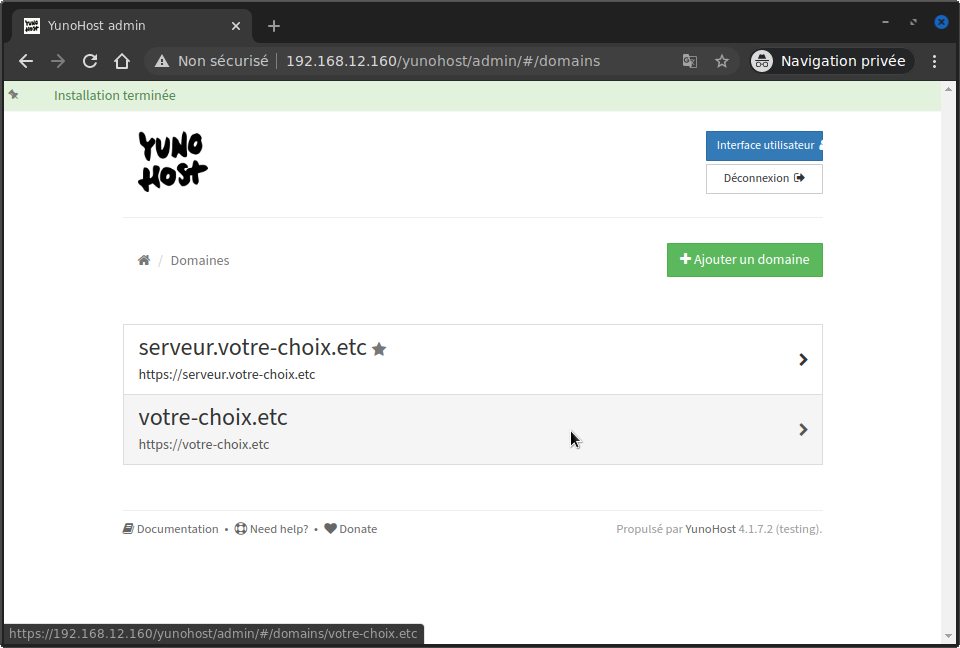

Et demander à *Voir la configuration DNS*.

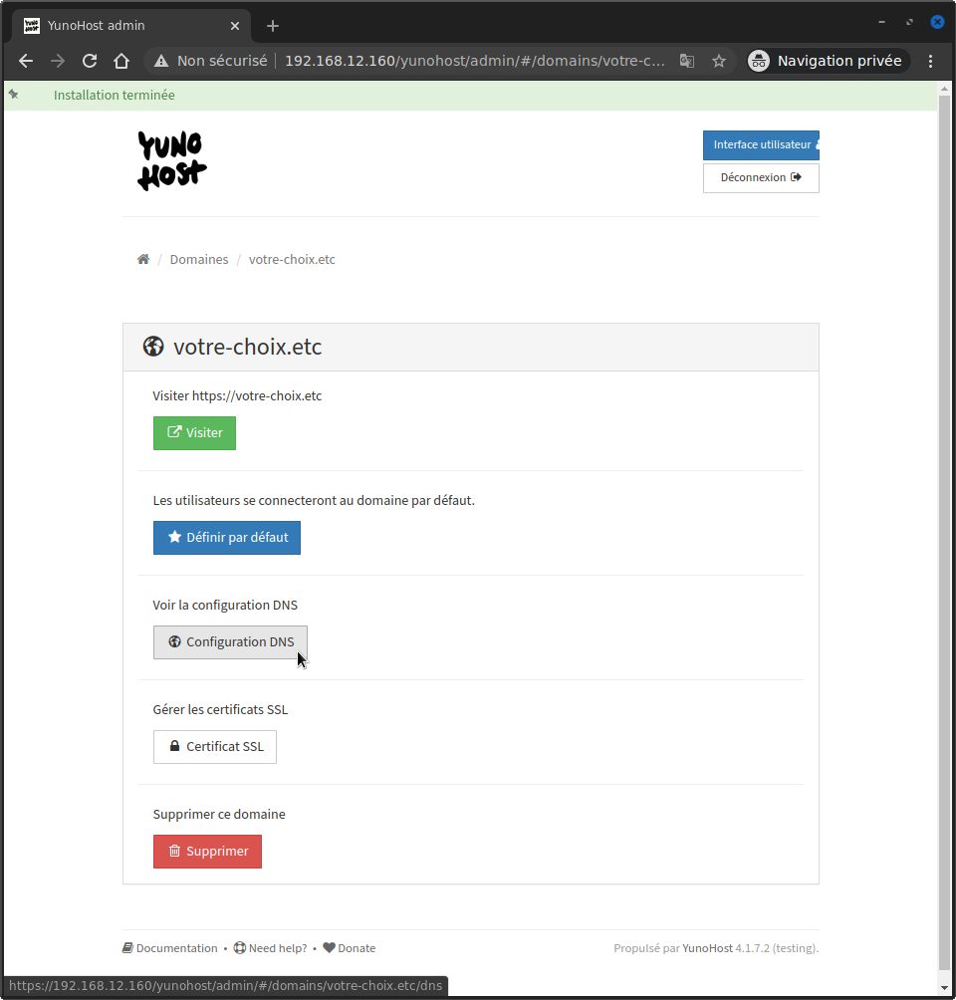

Ce qui vous donnera la liste des *enregistrements DNS* affichée en texte claire.

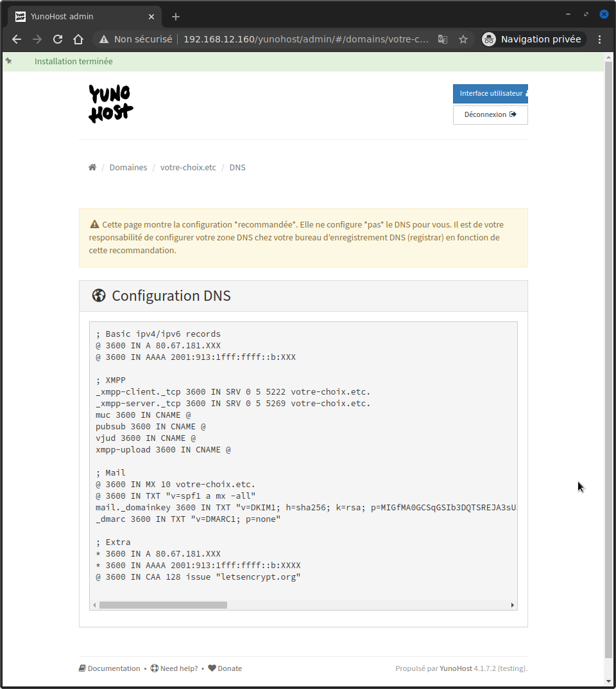

Cette *zone dns* est celle de votre serveur Yunohost et c'est elle que nous allons copier / coller auprès du bureau d'enregisrement du domaine `votre-choix.be`.

### Ligne de commande

Il est possible de faire la même chose depuis le terminal de votre serveur Yunohost.

```
sudo yunohost domain dns-conf votre-choix.etc
```

Donne les informations suivantes.

```
; Basic ipv4/ipv6 records
@ 3600 IN A 80.67.181.XXX
@ 3600 IN AAAA 2001:913:1fff:ffff::b:XXX

; XMPP
_xmpp-client._tcp 3600 IN SRV 0 5 5222 votre-choix.etc.
_xmpp-server._tcp 3600 IN SRV 0 5 5269 votre-choix.etc.
muc 3600 IN CNAME @
pubsub 3600 IN CNAME @
vjud 3600 IN CNAME @
xmpp-upload 3600 IN CNAME @

; Mail
@ 3600 IN MX 10 votre-choix.etc.
@ 3600 IN TXT "v=spf1 a mx -all"
mail._domainkey 3600 IN TXT "v=DKIM1; h=sha256; k=rsa; p=MIGfMA0GCSqGSIb3DQTSREJA3sUJEWB78xCjX0x0CcDf0YY9yhJBLABpmPEJdl5K4MfFyqzRsYxQGLsalbjkgI9wb3TrqI3FspD0yqNxfWGtHOWT1LyFietEyu0Si3jzmxuyX2ms9PmL+ZaNKghlHB7iUTUDNNlDUNWWQf0t2RCezns5HJXlTLoQXwncCMUawX7ODY56zlSTgwRANBZA"
_dmarc 3600 IN TXT "v=DMARC1; p=none"

; Extra
* 3600 IN A 80.67.181.XXX
* 3600 IN AAAA 2001:913:1fff:ffff::b:XXXX
@ 3600 IN CAA 128 issue "letsencrypt.org"
```

Cette *zone dns* est celle de votre serveur Yunohost et c'est elle que nous allons copier / coller auprès du bureau d'enregisrement du domaine `votre-choix.be`.

### Coller la zone auprès de votre bureau d'enregistrement DNS

Certains bureaux d'enregistrement de nom de domaines vous permettent de coller dirrectement le résultat des commande précédentes dans leur outil d'administration de nom de domaine.  D'autres vous demanderont d'effacer les enregistrement exitants et de recréer, un par un, ces enregistrements DNS.

Nous utilisons [Gandi]() qui permet de le faire en effaçant les lignes qui commencent par `;` et en laissant la première ligne de leur configuration.

```
@ 86400 IN SOA ns1.gandi.net. hostmaster.gandi.net. 1611579475 10800 3600 604800 10800
…
```

Cette première ligne renseigne le DNS sur le fait que, pour le domaine `votre-choix.etc`, ce sont les serveurs `ns1.gandi.net` et `hostmaster.gandi.net` qui sont les serveur de nom principaux.

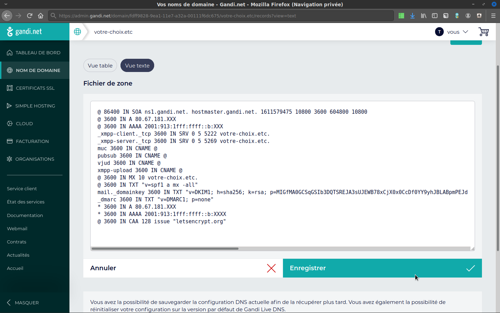

! La capture d'écran ci-dessus est a titre d'exemple. Pour d'autres bureaux d'enregistrement de domaines ou de gestionnaires DNS, les choses pourraient être différentes.

## Faire le RDNS chez Neutrinet

Cette étape se fait avec l'aide des bénévoles de Neutrinet.  Elle est **cruciale pour l'utilisation de votre serveur en tant que serveur mail**.  En effet, lorsque votre serveur enverra un mail à une autre serveur, ce dernier va demander au DNS « mais qui est cette adresse IP qui se connecte chez moi ? ».  Et sans cette étape l'adresse IP aura pour nom « quelque.choses.neutri.net » au lieu de `serveur.votre-choix.etc`.

Pour votre curiosité, voici une [documentation disponible](https://wiki.neutrinet.be/fr/infra/reverse-dns#effacer_un_ptr_record) sur le wiki de Neutrinet pour les bénévoles disposant des droits d'accès au serveur DNS de Neutrinet asbl.

## Let's Encrypt

Enfin, pour finir, maintenant que votre serveur Yunohost est installé, dispose d'un VPN et d'adresses IP fixes *(v4 et v6)*, que le DNS est configuré, il nous reste à activer Let's Encryt pour vos domaines.

Cela se fait dans l'interface d'administration de votre Yunohost, dans la catégorie Domaines.

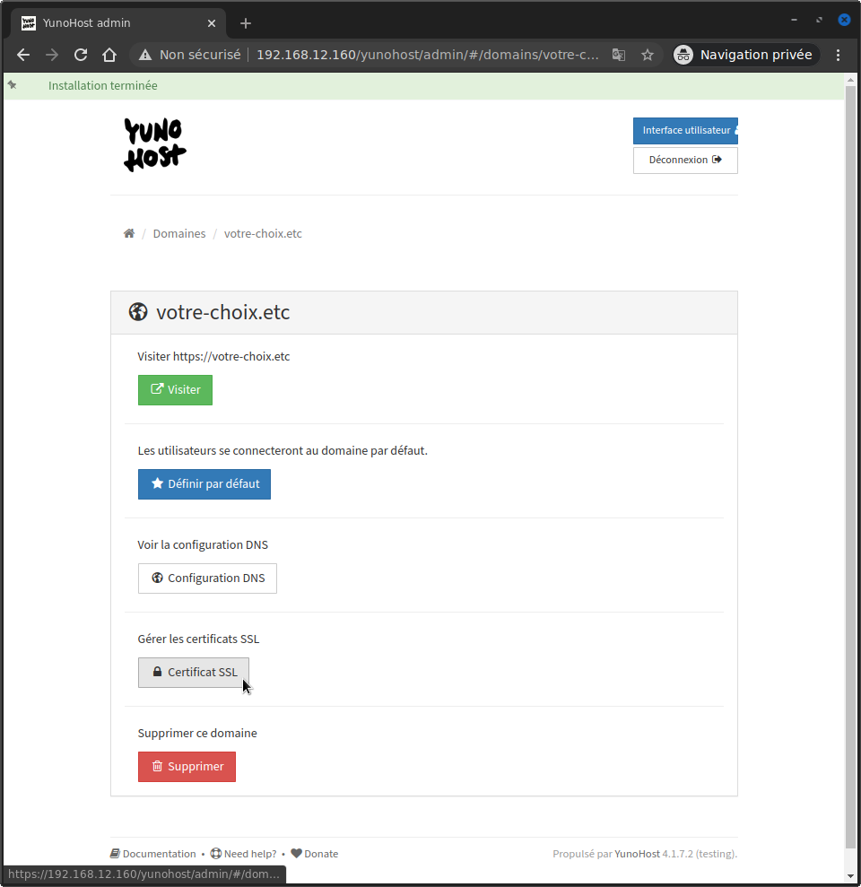

Votre installation étant à priori fonctionnelle, le bouton *Installer un certificat Let's Encrypt* vous sera disponible.  Ce n'est pas le cas ici parceque le domaine `votre-choix.etc` est un domaine fictif qui n'existe pas sur Internet.

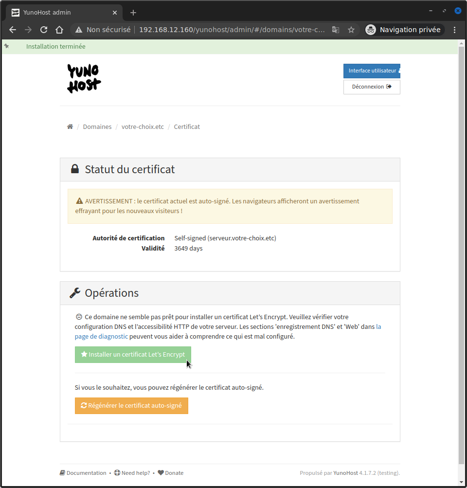

L'installation de ce certificat se fait automatiquement sans devoir configurer autre choses et lorsque cela sera fait, `https://votre-choix.etc` ou `https://serveur.votre-choix.etc` seront joignables sans avoir de message d'erreur de la part de votre navigateur.

## Remerciements

  * À vous, d'avoir parcourus ce tutoriel jusqu'ici et de vous lancer dans la grande aventure de l'auto-hébergement.
  * À tous et toutes les bénévoles de Neutrinet asbl qui font tout ce qui est nécessaires pour faire fonctionner un VPN associatif depuis 2010 !
  * À tous et toutes les personnes qui contribuent au développement de Yunohost et au packaging des applications.