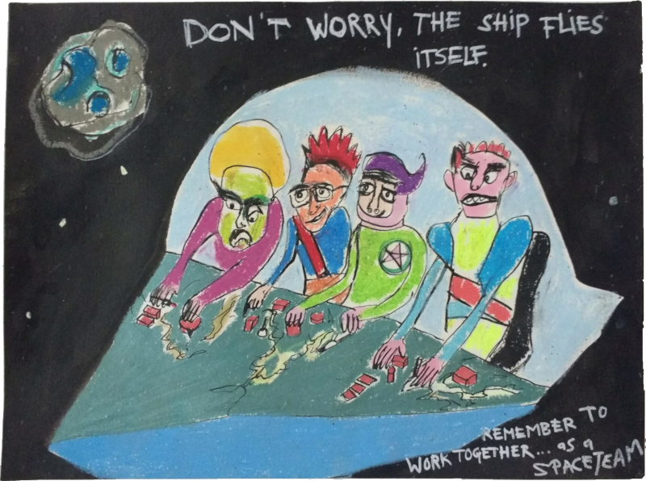

## AG 2020 de la Fédération FDN

[center]
                               & Chaul'Hertz, Intarnet, SamesWireless, SDN [et d'autres encore](https://www.ffdn.org/fr/membres).
[/center]

Le rassemblement des FAI associatifs se déroulera à partir du [size=26]vendredi 16[/size] octobre jusqu'au [size=26]lundi 19[/size] octobre et **l'AG formelle se tiendra le samedi 17** octobre.

[center]
[Liste des participant·e·s](participations?classes=btn,btn-error,btn-lg)
[Faire un don](don?classes=btn,btn-primary,btn-lg)
[Vous inscrire](inscription?classes=btn,btn-error,btn-lg) 

**Le contenu de ces quelques pages évoluera au fil du temps,  alors n'hésitez pas à repasser *(pas votre linge, mais par ici)*.**
[/center]

### Faire ensemble

Il y a plusieurs pièces, espaces, salons et autres lieux pour vous concentrer sur différents [ateliers](ateliers) qui pourraient prendre place durant ces quelques jours de rassemblement. L'organisation des ateliers est libre et le lieu est un outil qui est mis à votre disposition.

!!!! Merci de bien vouloir participer en organisant l'un ou l'autre [atelier](ateliers) si c'est possible pour vous.

### Au Performance Art Forum (PAF)

* Avec un long [texte d'introduction](paf/introduction)
* Et une [responsabilité collective](paf/responsabilite) recommandée
* Le lieu [en images](paf/lieu) et sous forme de [plan](paf/plan)
* Comment [y venir](paf/venir)
* À propos [d'accessibilité](accessibilite)
* À propos du [COVID-19](covid19)

### Dormir

* Voir [quelques chambres](paf/lieu/chambres)
* À propos du [self-checkin](paf/self-checkin)

### Manger

On va devoir se débrouiller pour la cuisine et on fera attention aux besoins de chacun·e… ça fera partie des « [ateliers](https://pads.ffdn.org/p/ag2020-activites-yee622v) » ^_^

### Boire

On devrait avoir des bières et une tireuse, mais on aimerait bien trouver aussi une machine qui fait des granita pour avoir autre chose qu'une pompe à bière, du pinard et du café.

### Assemblée Générale formelle

Elle se tiendra le samedi 17 octobre, un peu au matin, un peu après-midi et <a href="https://www.ffdn.org/wiki/doku.php?id=evenements:ag2020:ag_formelle">l'ordre du jour est sur le wiki de la fédé</a>.

!!!! [center]Si vous avez des questions, nous tâcherons d'y répondre. Neutrinet asbl ♥ <a href="mailto:ag2020@neutrinet.be?subject=[AGFFDN2020] Accueil&body=Étant passé par la page d'accueil de l'AG, j'ai l'une ou l'autre question remarque ou commentaire.%0D%0A%0D%0A%0D%0A">ag2020@neutrinet.be</a> [/center]

[center][/center]
