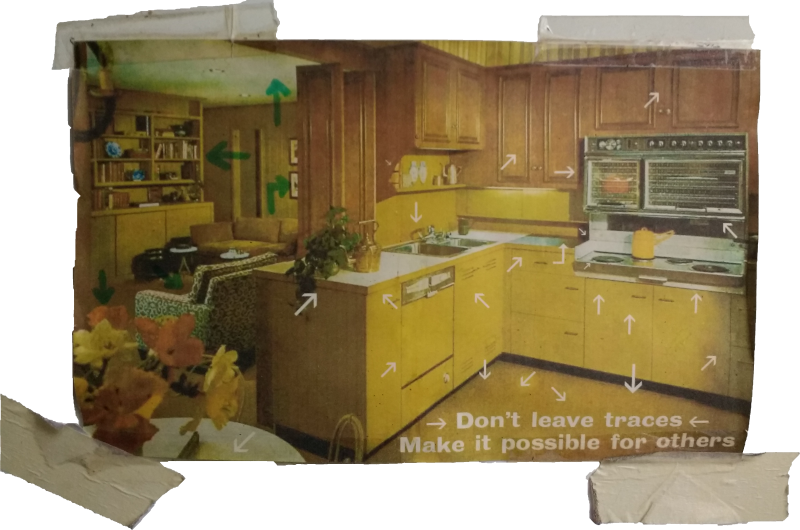

[Back to the main page of the GA](/ag2020?classes=btn,btn-primary)

!!!! This the default content for any guest who wishes to come working at PAF.

[PAF](http://pa-f.net) is a place for production; it is also produced and maintained daily by the people who stay here (you). PAF tries not to exclude, instead it wants to encourage all sorts of differences in resources, capacities, interests, backgrounds and knowledge. To avoid policing and hierarchical structures, PAF tries to create safety and care from within – this is an ongoing practice to be carried by all.
 
Whatever project you’re working on, PAF can make it possible for you only if you make it possible for PAF too. The things in PAF are there for you and you are there for the things as well ( i.e. PAF, the coffee machine, a lecture or a corridor is there for you as much as you are there for PAF, the coffee machine, the lecture or the corridor).
 
Prices in 2019 are: 18 euro per night when you stay 5 nights and more (20 euro when less) - 475 euro for a month ; plus a 12 euro membership fee, valuable for 12 months.
You’ll be asked to agree to PAF membership terms by filling in and sign a form that says PAF is not liable for any damage done to you.
Payment is only in cash or french chèque. Your membership and payment should be made upon arrival or in the first days of your stay. No creditcards nor banktransfer accepted. There is an ATM machine in the Supermarket.
 
There are two kitchens, so people can cook their own food.
 
To order a taxi to pick you up at the train station, call: Taxi Leblanc I St-Erme I +33 (0)323 226 909 (French speaking only).
Rate is: 7 euros from St-Erme station and 40 euros from Laon station before 7am ; after 7pm and on weekends, prices rise up to 52 euros.
Please call them on beforehand - ideally the day before - as they are quite busy (possible to ask for a 7 seats car for the same price when you’re many). When the weather is nice you can also walk (station is 2200 meter away): take the road between the Pharmacie and the café 'Cap Vert' and follow the white line (it goes constantly up).
 
Look [here](http://pa-f.net/basics/directions) for more info on how to get to PAF.
 
To enhance the Taking Care For Yourself And For The Other, we experiment with a self-check-in. This is displayed in the entrance hall. Please respect the free (green) or occupied (red) sign, even when a room seems to be empty. There might be some planning reasons. You'll find sheets and towel in the laundry room (please respect orderly piles).
 
PAF wants to be an easily accessible and self-organised space: it has no selection and is relatively cheap, its doors are open and it's guided by four rules:

- Don't leave traces
>Clean behind you in order to leave every square centimeter -that is not your private room- all the time available for everybody when you are not using it.
>Traces are unwanted or uninvited marks (material or immaterial) left in the space or in others.
 
- Make it possible for others
>Think of this as an opportunity to open up space(s) by showing a rehearsal or a movie, giving a lecture, starting a discussion, cleaning a corridor, or helping somebody.
 
- The do-er decides
>But not alone! Things are decided by the ones who do, more than the ones who talk. However, the opportunity to do is not without limits and action should be taken in consideration with others.
 
- Mind asymmetries
>PAF is made of asymmetries. People come from different places, inhabit different bodies, have different experiences, are situated differently in power structures and have different boundaries. Take this into account, challenge your own position and let it be challenged, while respecting other people’s boundaries.
 
Think those rules as interrelated.
 
PAF aspires to be a space where intersectional, anti-racist and feminist analysis inform practice. Sexism, racism, classism, LGBTQ+phobia, ableism, ageism and any other form of discrimination or aggression are not tolerated. PAF fosters a practice of collective accountability and considers it everybody’s responsibility. More info, guidelines and resources are available here.
 
As said before PAF is a place for production and concentration. The physical infrastructure of PAF can be challenging and risky for kids, and the presence of children can make concentration difficult when not correctly dealt with by the community, if you need to bring your children with you please advise us in advance and make sure there is an agreed upon organisation. And we will ask you to sign a disclaimer stating that you know PAF is a risky place for kids and that you take full liability for this.

Furthermore, because of the presence of animals who have their habitat in PAF as well as the constraints of the garden and the hygiene of the rooms, we would prefer not to have people bringing their pets to PAF, nonetheless if they are indispensable companions for you then again please contact us to clarify an agreed upon organisation.
 
PAF's relationship with the village is fragile. Paf is in a way semi-legal. Careful and positive relations with the villagers are necessary for its existence. PAF organises concerts, English conversation and a knitting group for the villagers. Please refrain from arty interventions or site specific events in the village and avoid loud noises in the night in the garden or the building.
 
The mutual use of the available studios is discussed and negotiated between the colleagues when you are in PAF. The principles and rules are the guidelines for this.
 
We wish you a fruitful time in PAF.
 
PAF 
contactpaf@gmail.com I +33 (0)6 03 43 27 74 
15 rue haute I 02820 Saint-Erme-Outre-et-Ramecourt