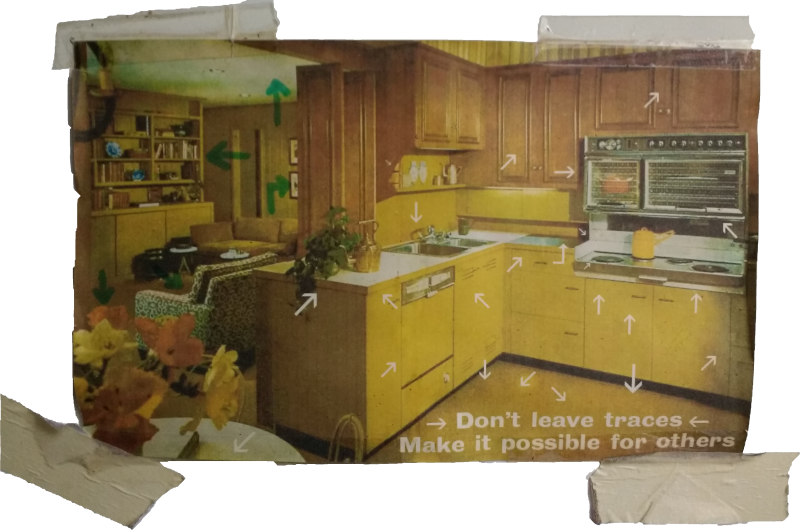

[center]
[Retour au sommaire de la rencontre](/rencontre-ffdn-2020?classes=btn,btn-primary) [Description & Photos](/rencontre-ffdn-2020/paf/lieu?classes=btn,btn-error) [Plan](/rencontre-ffdn-2020/plan?classes=btn,btn-error) 
[/center]

### Introdution du PAF 

!!!! Ceci est le texte habituel que le Performance Art Forum (PAF) communique à quiconque souhaite venir y travailler.

[PAF](http://pa-f.net/) est un lieu de production ; il est également maintenu et entretenu quotidiennement par les personnes qui y séjournent (vous). Le PAF essaie de ne pas exclure, mais plutôt d'encourager toutes sortes de différences de ressources, de capacités, d'intérêts, d'antécédents et de connaissances. Pour éviter les structures hiérarchiques de maintien de l'ordre, le PAF s'efforce d'entretenir un sentiment de sécurité et d'attention de l'intérieur - il s'agit là d'une pratique permanente qui doit être appliquée par toutes et tous.

Quel que soit le projet sur lequel vous travaillez, PAF peut le rendre possible pour vous, si vous le rendez possible pour le PAF aussi. Ce qui est au PAF est là pour vous et vous êtes là pour pour les choses que vous y trouverez ( ex. le PAF, la machine à café, une pièce de conférence ou un corridor est là pour vous autant que vous êtes là pour le PAF, la machine à café, la pièce de conférence ou le corridor).
 
Les prix en 2019 sont : 18 euros par nuit pour un séjour de 5 nuits et plus (20 euros si moins) - 475 euros pour un mois ; plus 12 euros de cotisation, valable 12 mois.
On vous demandera d'accepter les conditions d'adhésion au PAF en remplissant et en signant un formulaire qui indique que le PAF n'est pas responsable des dommages qui vous seraient causés. Le paiement s'effectue uniquement en espèces ou en chèque français. Votre adhésion et votre paiement doivent être effectués à votre arrivée ou dans les premiers jours de votre séjour. Aucune carte de crédit ou virement bancaire n'est accepté. Il y a un distributeur automatique de billets dans le supermarché.

Il y a deux cuisines qui vous permettront de faire vos repas.
 
Pour commander un taxi pour venir vous chercher à la gare, appelez : Taxi Leblanc I St-Erme I +33 (0)323 226 909.
Le tarif est de : 6 euros à partir de la gare de St-Erme et 35 euros à partir de la gare de Laon avant 7h ; après 19h et le week-end, les prix montent à 7 euros et 42 euros.
Veuillez les appeler à l'avance - idéalement la veille - car ils sont très occupés (possibilité de demander une voiture 7 places pour le même prix quand vous êtes nombreux). Quand il fait beau, vous pouvez aussi marcher (la gare est à 2200 mètres) : prenez la route entre la Pharmacie et le café Cap Vert et suivez la ligne blanche (elle monte constamment).
 
Voyez [ici](http://pa-f.net/basics/directions) pour d'autre infos pour vous rendre au PAF.

Pour améliorer le concept de Prendre Soin de Soi et de lAutre, nous expérimentons l'auto-enregistrement. Celui-ci est affiché dans le hall d'entrée. Veuillez respecter les étiquettes libre (vert) ou occupé (rouge), même lorsqu'une pièce semble vide. Il pourrait y avoir des raisons de planification. Les draps et les serviettes de bain se trouvent dans la buanderie (veuillez respecter les piles ordonnées).
PAF se veut un espace facilement accessible et auto-organisé : il n'a pas de sélection et est relativement bon marché, ses portes sont ouvertes et il est guidé par quatre règles :

[div id="4rules"][/div]

#### Ne laissez pas de traces
> Nettoyez derrière vous afin de laisser chaque centimètre carré -ce n'est pas votre chambre privée- tout le temps disponible pour tout le monde quand vous ne l'utilisez pas.
> Les traces sont des marques indésirables ou non désirées (matérielles ou immatérielles) laissées d'un endroit à l'autre.

#### Permettez à d'autres

> Considérez cela comme une occasion d'ouvrir un espace en montrant une répétition ou un film, en donnant une conférence, en lançant une discussion, en nettoyant un couloir ou en aidant quelqu'un.

#### Les faiseurs et faiseuses décident

> Mais pas seuls ! Les choses sont décidées par ceux et celles qui font, plus que par ceux qui parlent. Toutefois, la possibilité de faire n'est pas sans limites et les actions devraient tenir compte des autres.

#### Asymétries mentales

> Le PAF est fait d'asymétries. Les gens viennent d'endroits différents, habitent des corps différents, ont des expériences différentes, sont situés dans des structures de pouvoir différentes et ont des frontières différentes. Tenez-en compte, remettez en question votre propre position et laissez-la être remise en question, tout en respectant les limites des autres. 

> Cette quatrième règle est [décrite plus en détail](/rencontre-ffdn-2020/paf/responsabilite) parce que c'est probablement la plus difficile.

**Considérez ces règles entremèlées.**

Le PAF aspire à être un espace où les analyses intersectionnelles, antiracistes et féministes conditionnent les pratiques. Le sexisme, racisme, classicisme, les LGBTQ+phobies, le capacitisme, l'âgisme et toutes autres formes de discrimination ou d'agressions ne sont pas tolérées. Le PAF nourrit une pratique de responsabilisation collective et considère qu'elle émane des engagements individuels. Vous trouverez plus d'infos, ainsi que des lignes directrices et d'autres ressources, ici.
 
Comme écrit plus haut, le PAF est un endroit de production et de travail intellectuel. L'infrastructure du PAF peut être risquée et compliquée pour les plus jeunes, et la présence d'enfants, lorsque ce n'est pas bien géré par la communauté, ne facilite pas la concentration. Si vous devez amener vos enfants, veuillez nous prévenir à l'avance et veiller à ce que quelque chose soit prévu pour leur accueil. Nous vous demanderons de signer un document statuant que vous avez pris connaissance que le PAF n'est pas un lieu aménagé pour les enfants et que vous en assumez l'entière responsabilité.

De plus, dû à la présence d'animaux résidents au PAF et aux contraintes liées au jardin et au bon entretien des pièces intérieures, nous préférons que les visiteurs n'emmènent pas leurs animaux. Toutefois, s'ils vous sont d'inséparables compagnons, veuillez nous contacter afin que les mesures adéquates puissent être prises.

Les relations du PAF avec le village sont fragiles. Le PAF est, en quelque sorte, paralégal. Il est important pour son existence que les relations avec les habitants soient prudentes et attentionnées. Le PAF organise des concerts, des tables de conversations en anglais et un groupe de tricot pour les habitants. Veuillez évitez les performances artistiques ou évènements propres au site dans le village, il est demandé également d'éviter d'être trop bruyant durant la nuit, que ce soit dans les jardins ou à l'intérieur du bâtiment.
 
L'utilsation mutuelle des locaux est envisagée et négociée par les cohabitants durant leur présence au PAF. Les règles et principes en régissent les lignes directrices. 

Nous vous souhaitons un séjour fructueux au PAF.

PAF 
contactpaf@gmail.com I +33 (0)6 03 43 27 74 
15 rue haute I 02820 Saint-Erme-Outre-et-Ramecourt

!!!! [center]Si vous avez des questions, nous tâcherons d'y répondre. Neutrinet asbl ♥ <a href="mailto:ag2020@neutrinet.be?subject=[AGFFDN2020] PAF introduction&body=Étant passé·e par la page d'introduction du PAF, j'ai l'une ou l'autre question remarque ou commentaire.%0D%0A%0D%0A%0D%0A">ag2020@neutrinet.be</a> [/center]