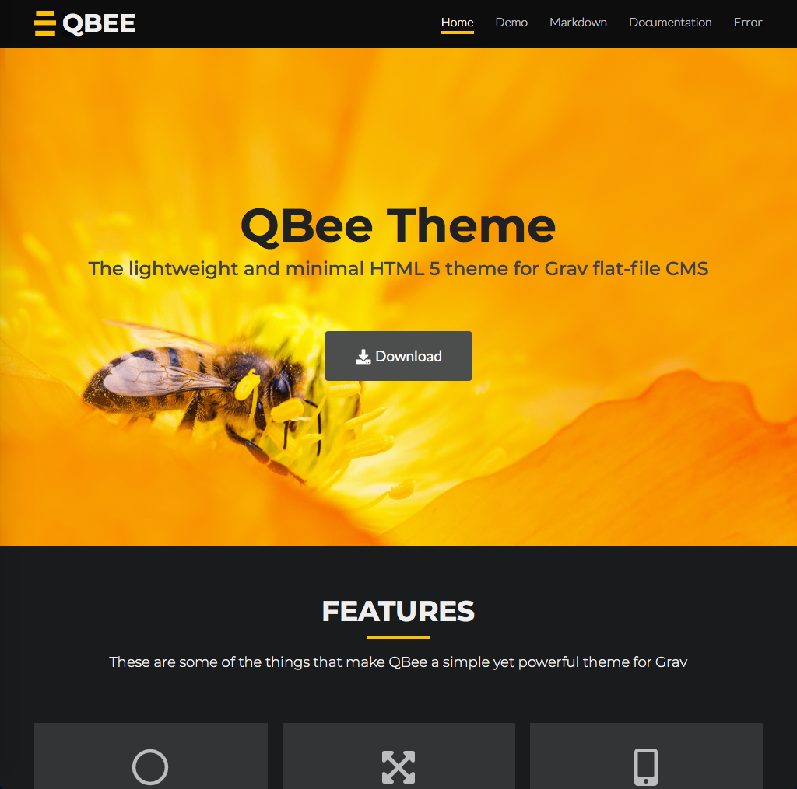
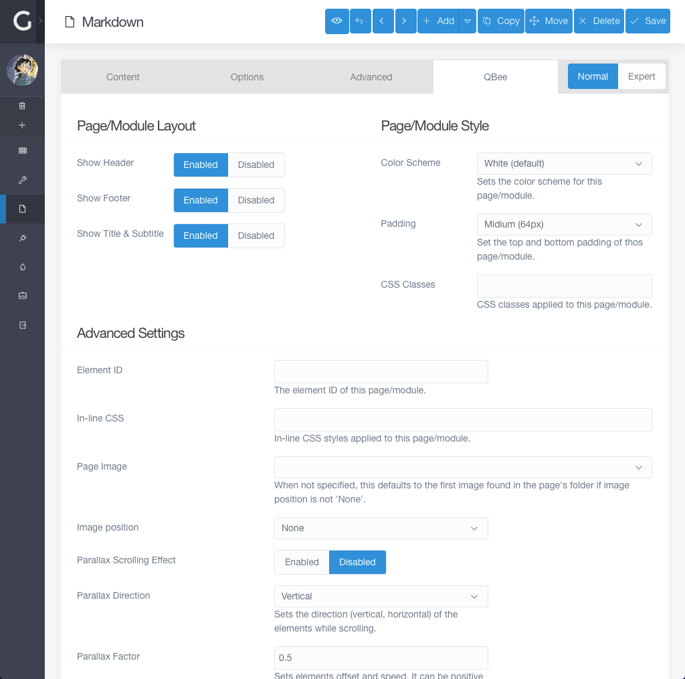

# QBee - Grav Theme

QBee is a clean, lightweight and minimal HTML 5 theme for [Grav](https://getgrav.org) built with the [Kube](https://imperavi.com/kube/) CSS &amp; JS Framework.



## Demo

A live demo of QBee Theme is available at: http://qbee.jorgetite.com/

## Features
* Clean and minimal
* Responsive and mobile friendly
* Lightweight and fast loading
* Clean typography
* Search engine optimized
* Modern browser compatible
* Very extensible and customizable
* Kube Framework
* Font Awesome
* HTML5, CSS3, JavaScript

### Supported Browsers
QBee supports the latest, stable releases of all major browsers:

- Latest Chrome
- Latest Firefox
- Latest Safari
- Latest Opera
- Microsoft Edge
- Internet Explorer 11

## Installation

Installing the QBee theme can be done in one of two ways:

- The GPM (Grav Package Manager) installation method enables you to quickly and easily install the theme with a simple terminal command
- The manual method enables you to do so via a zip file.

### GPM Installation (Preferred)

The simplest way to install this theme is via the Grav Package Manager (GPM) through your system's Terminal (also called the command line). From the root of your Grav install type:

```Shell
bin/gpm install qbee
```

This will install the QBee theme into your `/user/themes` directory within Grav. Its files can be found under `/your/site/grav/user/themes/qbee`.

### Manual Installation

To install this theme, just download the zip version of this repository and unzip it under `/your/site/grav/user/themes`. Then, rename the folder to `qbee`. You can find these files either on [GitHub](https://github.com/jorgetite/QBee) or via [GetGrav.org](http://getgrav.org/downloads/themes).

You should now have all the theme files under

```Shell
/your/site/grav/user/themes/qbee
```

### Requirements

* Grav 1.4+

## Theme Options

QBee allows you to set the following options site-wide:

| Setting Name     | Default  | Description 
|------------------|----------|----------------------
| `enabled`        | `true`   | Enables or disables the theme
| `production_mode`| `true`   | Serves CSS and JS files minimized
| `header_sticky`  | `false`  | Keeps the header always visible at the top of the page
| `show_site_name` | `true`   | Displays the site name in the header
| `show_site_logo` | `true`   | Displays the site logo in the header
| `site_logo`      |          | The relative path to the site logo. If no path is specified the them uses by default `images/logo.png`
| `site_copy`      |          | The copyright notice displayed in the footer

To make modifications, you can copy the `user/themes/qbee/qbee.yaml` file to `user/config/themes/` folder and modify, or you can use the admin plugin.

```yaml
enabled: true
production_mode: true
header_sticky: false
show_site_name: true
show_site_logo: true
```

> WARNING: Do not modify the `user/themes/qbee/qbee.yaml` file directly or your changes will be lost with any updates

## Pages

QBee supports the following page templates:

* Default view template `default.md`
* Error view template `error.md`
* Modular view templates: `modular.md`
    + Splash Modular view template `splash.md`
    + Profile Modular view template `profile.md`
    + Features Modular view template `features.md`
    + Hero Modular view template `hero.md`
    + Text Modular view template `text.md`

### Page Options

QBee provides several options in the page frontmatter to fine control how pages are displayed and styled. These options are available for all page templates supported by QBee:

#### Content Settings

| Setting Name     | Default  | Description 
|------------------|----------|----------------------
| `subtitle`       |          | The page or module subheading

```yaml
subtitle: 'Lorem ipsum dolor sit amet, consectetur adipisicing elit.'
```

#### Layout Settings

| Setting Name     | Default  | Description 
|------------------|----------|----------------------
| `show_header`    | `true`   | Controls whether the site header is displayed or not. This option is available only for `default.md`, `error.md` and `modular.md` templates
| `show_footer`    | `true`   | Controls whether the site footer is displayed or not. This option is available only for `default.md`, `error.md` and `modular.md` templates
| `show_heading`   | `true`   | Controls whether the title and subtitle are autiomatically displayed at the top of the page, or not. This option is not available for `modular.md` templates
| `onpage_menu`    | `false`  | Renders a on page menu for modular pages. This option is available only for `modular.md` templates
| `menu_icon`      |          | Sets the menu icon for the page

```yaml
show_header: true
show_footer: true
show_heading: true
onpage_menu: false
menu_icon: 'fas fa-home'
```

#### Style Settings

| Setting Name     | Default       | Description 
|------------------|---------------|----------------------
| `color_scheme`   | `scheme-light`| Sets the appearance of the page. The following values are available:<br />`scheme-light`: White (default)<br />`scheme-gray-light`: Lightgray<br />`scheme-gray-dark`: Dimgray<br />`scheme-dark`: Black
| `padding`        | `md-pad` | Sets the top and bottom padding of the page. The following values are available:<br /> `no-pad`: No padding<br />`xs-pad`: Smaller (16px)<br />`sm-pad`: Small (32px)<br />`md-pad`: Midium (64px)<br />`lg-pad`: Large (96px)<br />`xl-pad`: Larger (128px)
| `css_classes`    |          | Additional CSS classes space separated. (see ' CSS Classes' below)

```yaml
color_scheme: scheme-light
padding: md-pad
css_classes: 'my-css-class'
```

> Note: These options are not available for `modular.md` templates


#### Advanced Settings
| Setting Name     | Default    | Description 
|------------------|------------|----------------------
| `id`             |            | Sets the ID of the HTML element representing the page
| `css_styles`     |            | Sets additional css styles that are applied inline to the the page
| `image`          |            | Sets an image to be displayed in this page. When not specified, this defaults to the first image found in the page''s folder if `image_position` is not `none`.
| `image_position` | `none`     | Determines the position of the image in the page. Possible valueas are:<br />`none`: No display<br />`back`: Display in the background<br />`left`: Display image aligned to the left<br />`right` Display image aligned to the right
| `parallax_enabled` | `false`  | Enables parallax scrolling effect with background image
| `parallax_direction` | `vertical`  | Sets the direction `vertical` or `horizontal` of the background image while scrolling.
| `parallax_factor` | `0.5`  | Sets elements offset and speed. It can be positive (0.5) or negative (-0.5). Less means slower 

```yaml
id: 'my-page-id'
css_styles: 'background: linear-gradient(to bottom, #1a2a6c, #b21f1f, #fdbb2d);'
image: 'custom-image.png'
image_position: back
parallax_enabled: true
parallax_direction: vertical
parallax_factor: '0.5'
```

> Note: These options are not available for `modular.md` templates

### Features Modular Settings

The `features.md` modular template gives you the ability to define an array of feature items, as well as the column layout (in a 12 column grid layout) used to display the feature items.

```yaml
columns: col-3      # possible values: col-6, col-4, col-3, col-2
features:
    -
        icon: 'fas fa-palette fa-fw'
        header: Design
        text: 'Lorem ipsum dolor sit amet, consectetur adipisicing elit. Repellat quis natus, nesciunt accusantium beatae quae doloremque'
    -
        icon: 'fas fa-code fa-fw'
        header: Development
        text: 'Lorem ipsum dolor sit amet, consectetur adipisicing elit. Repellat quis natus, nesciunt accusantium beatae quae doloremque'
    -
        icon: 'fas fa-cloud fa-fw'
        header: Cloud
        text: 'Lorem ipsum dolor sit amet, consectetur adipisicing elit. Repellat quis natus, nesciunt accusantium beatae quae doloremque'
    -
        icon: 'fas fa-database fa-fw'
        header: Storage
        text: 'Lorem ipsum dolor sit amet, consectetur adipisicing elit. Repellat quis natus, nesciunt accusantium beatae quae doloremque'
```

> NOTE: QBee uses Fontawesome version 5's syntax. For more information please refer to [Fontawesome's documentation](https://fontawesome.com/how-to-use/on-the-web/referencing-icons/basic-use).

### Profile Modular Settings

The `profile.md` modular template gives you the ability to create an array of skills, for example:

```yaml
skills:
    -
        header: 'HTML & CSS'
        value: '90'
    -
        header: JavaScript
        value: '95'
    -
        header: PHP
        value: '80'
    -
        header: iOS
        value: '80'
    -
        header: MySQL
        value: '70'
```

### CSS Classes

| CSS Class     | Description 
|---------------|-----------------
| text-center   | centers the text/content of the page
| text-left     | aligns left the text/content of the page
| text-right    | aligns right the text/content of the page
| bg-blacken    | darkens the background of the page (useful with image backgrounds)
| bg-whiten     | whitens the bacground of the page (useful with image backgrounds)


### Configuration with Admin plugin

All the theme and page settings listed above can be easily managed using the [Admin Plug-in](https://github.com/getgrav/grav-plugin-admin).




## Customizing QBee

You can customize QBee by overriding or adding your own custom styles, scripts or theme images.

#### Custom Styles

Custom CSS styles or overrides should be added to the `css/custom.css` file.

#### Custom Scripts

Custom scripts should be added to `js/custom.js` file.

#### Custom Images

Your logo and favicon should be place inside the `images/custom` folder. This will ensure your images are not lost with theme updates.

## Credits
QBee was created using:

+ Kube Framework (https://imperavi.com/kube/)
+ Font Awesome (https://fontawesome.com)
+ JQuery One Page Nav (http://github.com/davist11/jQuery-One-Page-Nav)
+ JQuery Paroller (https://github.com/tgomilar/paroller.js)
+ Google Fonts (https://fonts.google.com)

## Contributing
Contributions to QBee are greatly appreciated, whether they are related to bugs, grammar, or simply a suggestion or improvement!

## License
The files contained in this project are released under the MIT License. You can find a copy of this license in LICENSE.txt file.
